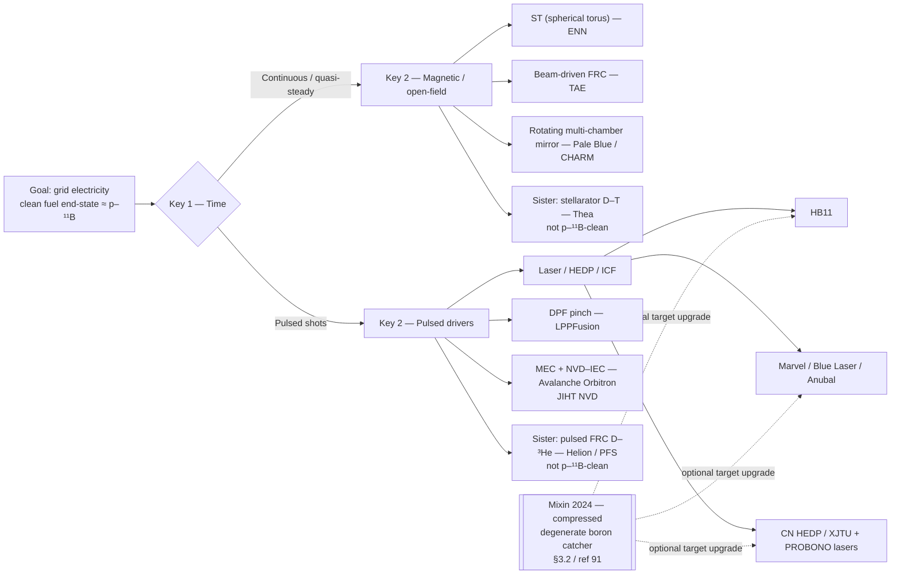
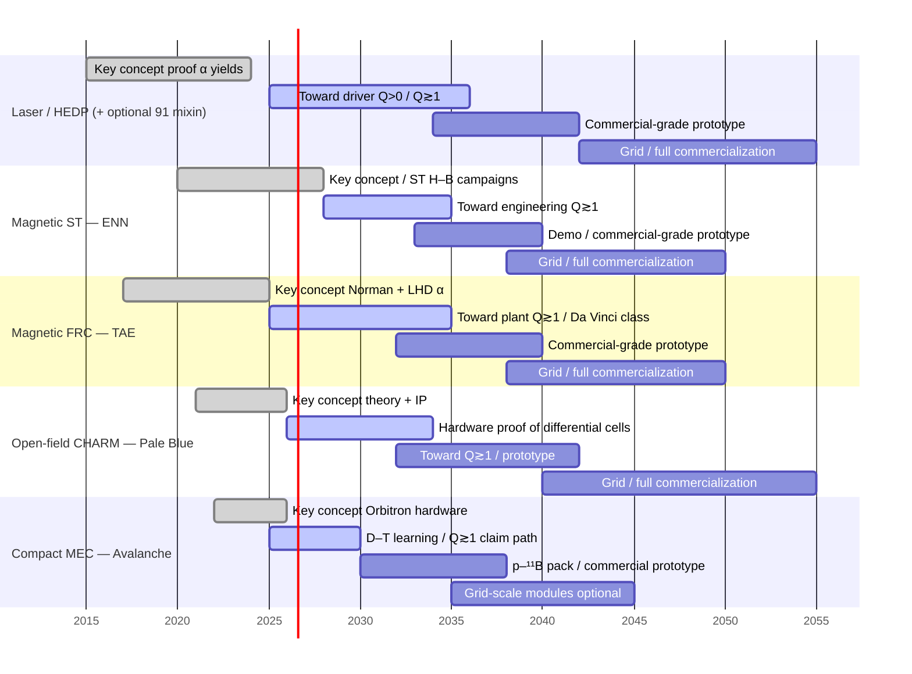
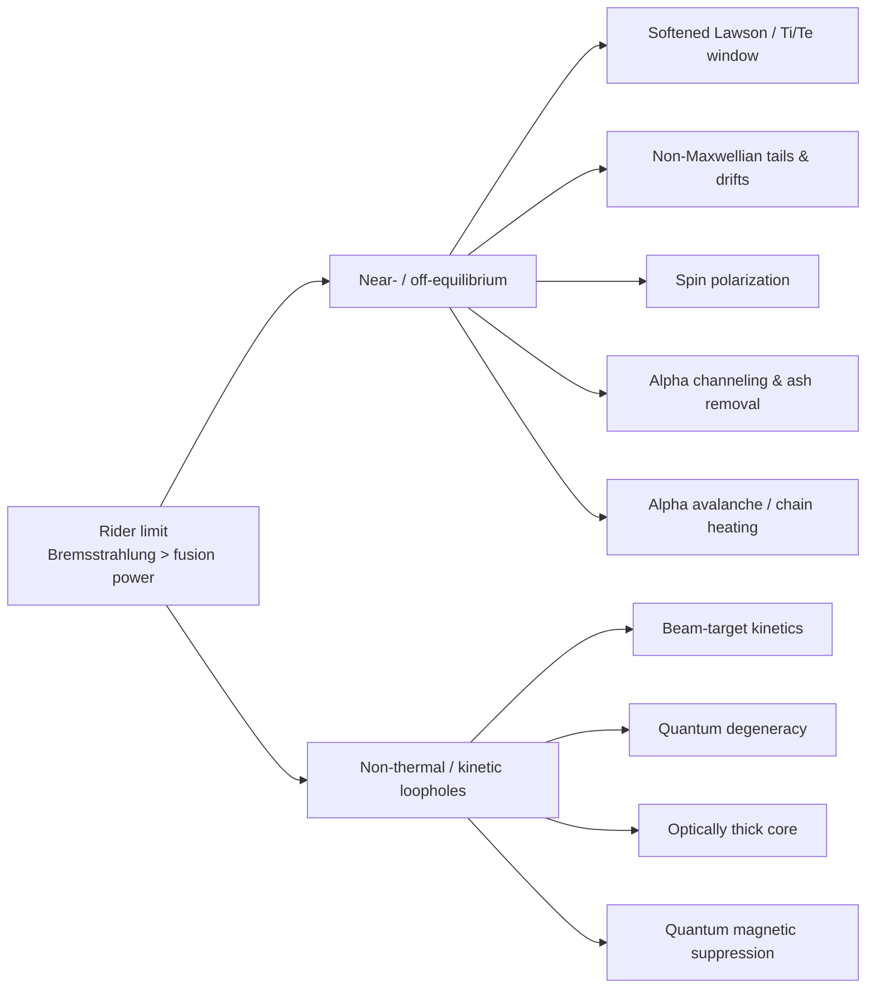
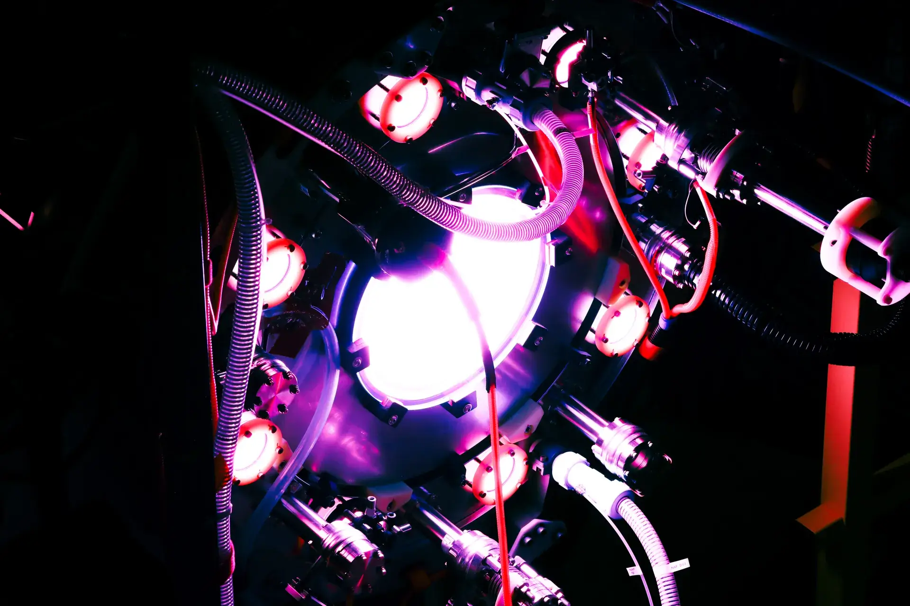
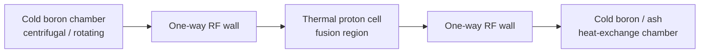
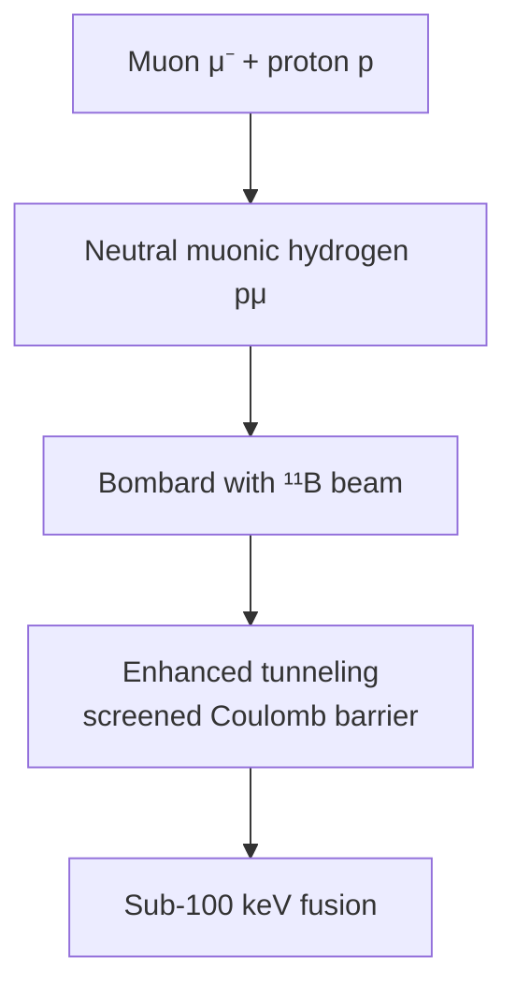

# State of the art on proton-boron fusion for electricity generation

## Abstract
**For decision-makers.** The goal of this field is ordinary grid electricity from fusion with essentially no long-lived radioactive waste and no tritium-breeding factory attached to the plant. The leading “clean” fuel for that goal is proton–boron-11 ($p\text{-}^{11}\text{B}$): abundant, non-radioactive inputs; helium ash; a path to converting charged fusion products straight into voltage. It is also much harder than today’s mainstream deuterium–tritium (D–T) research. This survey is a **catalog**: who is trying what, sorted by a simple four-axis map—(1) continuous vs pulsed operation, (2) confinement family (magnetic torus, laser/inertial, pinch, electrostatic / magneto-electrostatic confinement (MEC), …), (3) fuel end-state ($p\text{-}^{11}\text{B}$ vs sisters), (4) thermal vs nonthermal kinetics—then scored on a physicist’s feasibility checklist. You can stop after \secref{sec:intro} with a usable picture of the landscape.

**For working physicists and plant engineers.** The same document then goes into the weeds at the density of a conference overview such as China’s Fusion Energy Conference (FEC) pre-print on $p\text{-}^{11}\text{B}$ progress [12]: nuclear-data uncertainties, Rider / Bremsstrahlung limits and proposed loopholes, project-by-project gate scores (\autoref{tab:scorecard}), digital-twin tooling, patents, and materials / direct energy conversion (DEC) risks. Huasheng Xie’s zeroth-order feasibility frame [40] (extended here with in-silico and hardware-iteration axes) is the common rubric.

---

## 1. Why clean fusion, how to read this survey, and how we score projects {#sec:intro}

### 1.1 The goal (no equations yet) {#sec:goal}
Fusion is attractive because a small mass of fuel can release a large amount of energy. The version of fusion that has soaked up most of the world’s money—**deuterium–tritium (D–T)**—works at comparatively accessible conditions, but it throws off **fast neutrons**. Neutrons damage machine walls, create radioactive inventory, and force a complex **tritium breeding** blanket so the plant can remake its scarce fuel. That is an engineering mountain even after the plasma physics works.

**Clean fusion**, as used here, means: generate **electricity** while avoiding that mountain as far as physics allows—**no high-energy neutron flood**, **no radioactive fuel cycle**, **helium (or other charged) ash** instead of activated steel as the main waste story, and ideally **direct conversion** of charged fusion products into voltage rather than only boiling water for turbines.

**Proton–boron-11** is the flagship fuel for that brief:

$$p + {}^{11}\mathrm{B} \rightarrow 3\alpha + 8.7\,\mathrm{MeV}$$

Plain English: a proton and a boron-11 nucleus fuse to three helium nuclei (alpha particles) and release energy. The inputs are plentiful and non-radioactive. The outputs are charged, so in principle you can slow them in electric fields and harvest current. The catch—and the reason this survey exists—is that getting a *net* power plant on this fuel is far harder than on D–T: the reaction wants much higher particle energies, and hot electrons radiate X-rays (Bremsstrahlung) so fiercely that a naive “just heat a soup of protons and boron” design loses more power as light than it gains as fusion.

So the industry is not one race. It is many bets on **different machines** and **different cheats** against that radiation problem. The rest of \secref{sec:intro} gives you a map; later sections give the physics and the scorecard.

### 1.2 A tidy mental matrix: four axes {#sec:matrix}
Every project in this catalog can be placed on four axes. Memorize these four questions and you can listen to any pitch without drowning:

### Four-axis mental matrix (how to read any pitch) {#tab:matrix-axes}

| Axis | Question in plain language | Typical answers in this survey |
| :--- | :--- | :--- |
| **Time** | Does the machine run steadily, or in shots/pulses? | Continuous / quasi-steady magnetic plants; pulsed lasers; pulsed pinches / colliding field-reversed-configuration plasmoids; nanosecond vacuum discharges |
| **Confinement family** | What holds the fuel together long enough to fuse? | Closed magnetic (tokamak, **spherical torus (ST)**, stellarator); compact magnetic (**field-reversed configuration**, FRC); open magnetic / rotating mirror (CHARM); laser / **inertial confinement fusion (ICF)** / beam-target; magneto-inertial / **dense plasma focus (DPF)**; electrostatic / **MEC** including Orbitron and **nanosecond vacuum discharge–inertial electrostatic confinement (NVD–IEC)** |
| **Fuel end-state** | What is the *intended* commercial fuel—not the learning fuel? | Pure $p\text{-}^{11}\text{B}$; sister “advanced” fuels (D–$^3$He); D–T now with $p\text{-}^{11}\text{B}$ claimed later; D–T only (sister spinouts) |
| **Kinetics** | Is the fuel a hot thermal soup, or a nonthermal / beam / structured distribution? | Maxwellian thermal; softened hot-ion windows; beam-target / laser block; multi-chamber differential confinement; other Rider-bypass schemes |

**Annotation, not a fifth physics axis:** maturity style—software-first vs hardware-first (gates **S**/**H** below)—and product thesis (utility plant vs microreactor vs neutron/α source). Same physics family can still be different businesses.

Worked examples:

*   **ENN** → mostly *continuous* × *spherical torus (magnetic)* × *$p\text{-}^{11}\text{B}$* × *near-thermal with hot-ion / beam assists*.
*   **HB11 Energy** → *pulsed* × *laser inertial* × *$p\text{-}^{11}\text{B}$* × *nonthermal block ignition* (avalanche claims contested).
*   **Avalanche Energy** → *compact continuous-ish* × *Orbitron MEC* × *D–T learning, $p\text{-}^{11}\text{B}$ claimed capable* × *nonthermal orbiting ions*.
*   **Helion** → *pulsed* × *FRC* × *D–$^3$He* (not fully as clean as $p\text{-}^{11}\text{B}$) × *compressed plasmoids*.

### 1.3 Catalog at a glance (executive) {#sec:catalog}
One row per major effort in \autoref{tab:catalog-glance}. Detail and scoring live in \autoref{tab:scorecard} (\secref{sec:initiatives}) and \secref{sec:companies}. Device cutaways and concept figures for the major paths are archived under `research/figures/` (see `research/figures/CREDITS.md` for provenance).

### Catalog at a glance (executive, mid-2026) {#tab:catalog-glance}

| Who | Time | Confinement family | Fuel end-state | One-line status (mid-2026) |
| :--- | :--- | :--- | :--- | :--- |
| **ENN (China)** | Continuous | Spherical torus (ST) | $p\text{-}^{11}\text{B}$ | Largest national ST + nuclear-data program; demo roadmap ~2030s |
| **TAE Technologies** | Quasi-steady | Beam-driven FRC | $p\text{-}^{11}\text{B}$ | Deepest private FRC capital; Rostoker→Norman→Da Vinci lineage; Large Helical Device (LHD) alphas |
| **Pale Blue / CHARM (Princeton)** | Continuous open-field concept | Rotating multi-chamber mirror | $p\text{-}^{11}\text{B}$ | Strong theory + young intellectual property (IP); still incorporating; software-first |
| **HB11 Energy** | Pulsed | Laser block ignition | $p\text{-}^{11}\text{B}$ | Commercial laser path; ~4 orders below driver breakeven; avalanche/hybrid/DEC debated |
| **Marvel / Blue Laser / Anubal** | Pulsed | Laser / nano-ICF | $p\text{-}^{11}\text{B}$ (options) | European / California laser startups; facilities and patents growing |
| **LPPFusion** | Pulsed | Dense plasma focus (DPF) | Advanced / $p\text{-}^{11}\text{B}$ | Long-running DPF company |
| **Avalanche Energy** | Compact MEC | Orbitron (magneto-electrostatic) | D–T now; $p\text{-}^{11}\text{B}$ claimed | High hardware cadence; FusionWERX; not to be dismissed as a “fusor” |
| **JIHT / Kurilenkov** | Pulsed ns | NVD–IEC virtual cathode | $p\text{-}^{11}\text{B}$ | Russian lab alphas + KARAT particle-in-cell (PIC) scaling; same electrostatic neighborhood as Avalanche |
| **Helion / PFS** | Pulsed / small FRC | FRC / Princeton Field-Reversed Configuration (PFRC) | D–$^3$He | Serious capital (Helion) or microreactor line (PFS); **cleaner than D–T, not $p\text{-}^{11}\text{B}$-clean** |
| **Thea Energy** | Continuous | Planar-coil stellarator | D–T | Princeton spinout; DOE Helios path—sister company, different fuel |
| **LHD / NIFS, PROBONO, CN HEDP** | Facility / consortium | Helical / laser targets | $p\text{-}^{11}\text{B}$ experiments | Science infrastructure (incl. Japan’s National Institute for Fusion Science (NIFS)) and Chinese high-energy-density physics (HEDP) programs; not one commercial plant |

**Bottom line for an investor or bank executive.** There is a real $p\text{-}^{11}\text{B}$ ecosystem—not vapor—but **nobody has a utility-scale clean plant yet**. The hard problems are shared: radiation losses, ash handling, materials under extreme load, and proving net electricity (not just fusion reactions on a detector). Betting is about which *matrix cell* you think can close those gaps first—not about a single “winner gadget.”

#### 1.3.1 Executive map: architecture branches, a “mixin,” and the milestone ladder {#sec:exec-map}
Read this page like a diligence cheat sheet. \figref{fig:arch-branches} splits the catalog by the major keys from \autoref{tab:matrix-axes} (time → confinement family → named path). One 2024 physics idea—compressed degenerate boron [91]—is drawn as a **mixin**: it can attach to the pulsed laser / HEDP branch only, not to magnetic or Orbitron-class cores (\secref{sec:degeneracy}). \figref{fig:milestone-ladder} drops years down the page as an *indicative* ladder: key-concept proof → fusion gain $Q\gtrsim 1$ (engineering breakeven; some pitches say $Q>0$) → commercial-grade prototype → grid plant. Dates are **editorial judgments** from public roadmaps and physics gaps in this survey—not bank-grade forecasts, and **no path has closed $p\text{-}^{11}\text{B}$ plant $Q>1$ yet**.

**How to read \figref{fig:arch-branches}.** Start at the goal node, then follow **Key 1 (Time)** into continuous/quasi-steady magnetic paths (left) versus pulsed drivers (right). Named companies sit on the leaves. The dashed “mixin” box is *not* a separate machine—it is an optional target-physics upgrade that can only attach to laser / HEDP leaves.

<!-- mermaid-caption: Architecture branches and the compressed-degenerate boron mixin -->
<!-- mermaid-label: fig:arch-branches -->
<!-- mermaid-landscape -->

**How to read \figref{fig:milestone-ladder}.** Each horizontal band is one architecture family. Bars move left→right from “key concept proof” toward grid product; filled/active styling marks what looks already demonstrated versus still open. Compare *within* a band, not across bands as a race clock—sister-fuel rows can look earlier for *their* fuel without being $p\text{-}^{11}\text{B}$-clean.

<!-- mermaid-caption: Indicative milestone ladder by architecture family (mid-2026 survey view — not a forecast) -->
<!-- mermaid-label: fig:milestone-ladder -->

**How to use \figref{fig:milestone-ladder} (definitions).** “Key concept proof” = alphas or confinement validated at lab scale (already true in pieces for several rows). “$Q\gtrsim 1$” = fusion energy comparable to driver / recirculating plant power—still **open** for $p\text{-}^{11}\text{B}$ electricity everywhere in this survey. Sister-fuel programs (Thea D–T, Helion D–$^3$He) can look earlier on the same ladder *for their fuel*, but they are not the clean $p\text{-}^{11}\text{B}$ end-state (\secref{sec:sister-fuels}). The \secref{sec:degeneracy} mixin can only shorten the **Laser / HEDP** bars if compressed-degenerate targets prove out—it does not move ENN, TAE, or CHARM.

### 1.4 How to read the rest (two paths) {#sec:two-paths}
*   **Executive path (≈20 minutes):** \secref{sec:intro} (this section, including the \secref{sec:exec-map} maps) → skim \secref{sec:sister-fuels} (are other fuels as clean?) → \autoref{tab:scorecard} in \secref{sec:initiatives} → **\secref{sec:plant-odds} ranked plant-odds table** → \secref{sec:patents} patent/legal footprint if diligence matters. Skip the equations. Optional: one company page in \secref{sec:companies} that matches a pitch you just heard.
*   **Physicist / plant-engineer path:** continue in order. \secrefrange{sec:nuclear-data}{sec:diligence-gates} set nuclear data and the scoring rubric (\autoref{tab:diligence-gates}). \secrefrange{sec:rider-limit}{sec:loopholes} are the Rider bottleneck and proposed loopholes (prose density intentionally closer to Liu et al.’s China overview [12]). \secrefrange{sec:confinement}{sec:companies} map confinement and score each full-reactor path on the same gates—including compact MEC/IEC (\secref{sec:orbitron}). \secref{sec:muon} is speculative muon kinetics. \secref{sec:software} is software access. \secref{sec:materials} materials. \secref{sec:patents} IP.

### 1.5 Nuclear data uncertainties {#sec:nuclear-data}
**Plain-language lead-in.** Before you trust any plant spreadsheet, ask how well we know the basic collision odds: how often a proton hitting boron-11 actually fuses and makes three helium nuclei (alphas). Physicists call that probability a **cross-section**. Those odds are still uncertain by tens of percent—so “net power on paper” can move when the nuclear data move.

The $p + {}^{11}\mathrm{B} \rightarrow 3\alpha$ cross-section (nuclear notation: $^{11}\text{B}(p,\alpha)2\alpha$) has been studied since the 1930s, yet evaluations still disagree at the level of tens of percent—historically up to $\sim 30\%$ uncertainty within a dataset and $\sim 50\%$ between experiments—because early measurements suffered limited solid-angle coverage, incomplete particle identification, and sparse energy coverage away from a few resonances [12,13,14]. Modern evaluations (e.g., Nevins & Swain; Sikora & Weller) underpin reactor studies [13,14], and China’s program has made the nuclear data itself a first-class research-and-development (R&D) pillar [12].

Peking University has re-measured the reaction on a $2\times 1.7$ MV tandem over $0.675\text{--}3.0$ MeV proton energy using double-sided silicon strip detectors and high-statistics $3\alpha$ coincidence, separating the $\alpha_0$ (via $^{8}\text{Be}$ ground state) and $\alpha_1$ (via $^{8}\text{Be}^*$) channels [12]. The $\alpha_1$ channel dominates by roughly an order of magnitude yet remains the harder to model; Statistical Theory of Light Nucleus (STLN) analyses and Distorted-Wave Born Approximation (DWBA) direct-reaction studies still struggle to give a self-consistent description of primary versus secondary alphas and angular distributions [12]. Near the $\sim 160$ keV resonance, the $\alpha_0/\alpha_1$ branching ratio varies strongly with proton energy—directly shaping the emitted alpha spectrum for diagnostics and neutral-beam injection (NBI) heating design, and explaining the absence of a clear $\alpha_0$ peak in earlier LHD magnetic-confinement experiments [12,15].

### 1.6 Zeroth-order evaluation frame (after Xie) {#sec:xie-frame}
Comparing commercial $p\text{-}^{11}\text{B}$ concepts is easy to turn into a beauty contest of confinement gadgets. This survey instead scores every implemented or proposed *full reactor path* against a common **zeroth-order** rubric adapted from Huasheng Xie’s monograph *Introduction to Fusion Ignition Principles: Zeroth Order Factors of Fusion Energy Research* [40]. Xie borrows “zeroth order” from perturbation language: the **primary feasibility gates** that must be checked before investing in first-/second-order issues such as turbulence spectra or detailed magnetohydrodynamics (MHD) [40]. Using his checklist does **not** endorse his personal fuel preference (catalyzed D–D / D–$^3$He over $p\text{-}^{11}\text{B}$); ENN, where he works, prioritizes hydrogen–boron on environmental grounds [40]. The frame is the tool; the fuel choice remains open. \autoref{tab:matrix-axes} (*Four-axis mental matrix*) is the *orientation* map; \autoref{tab:diligence-gates} below is the *diligence* checklist.

### 1.7 Diligence gates (scoring checklist) {#sec:diligence-gates}

Adapted for **electricity from $p\text{-}^{11}\text{B}$**, the gates used throughout \secrefranges{sec:companies}{sec:initiatives} and \autoref{tab:scorecard} are shown in \autoref{tab:diligence-gates}.

### Zeroth-order diligence gates (p–¹¹B plant checklist) {#tab:diligence-gates}

| Gate | Question for a $p\text{-}^{11}\text{B}$ plant |
| :--- | :--- |
| **F — Fuel & nuclear data** | Are the measured $p + {}^{11}\mathrm{B} \rightarrow 3\alpha$ reaction odds (cross-section) good enough for design? Spin polarization or laser-field enhancement claimed? (\secref{sec:nuclear-data}; \secref{sec:spin-polarization}) |
| **K — Kinetics / Rider** | Thermonuclear Maxwellian, softened $T_i/T_e$ window, beam-target / block ignition, or structural non-equilibrium (multi-chamber)? How is $P_{i\to e}$ vs $P_f$ managed? (\secrefrange{sec:rider-limit}{sec:loopholes}) |
| **R — Radiation** | Bremsstrahlung and synchrotron: thin or thick? Suppressed (degeneracy, megatesla quantization)? Reflected / reabsorbed / converted? |
| **A — Ash & impurities** | How is $^4\mathrm{He}$ removed on a timescale $\ll\tau_E$? Wall/$Z_{eff}$ poisoning controlled? (\secref{sec:alpha-channeling}, \secref{sec:materials}) |
| **L — Lawson / engineering $Q$** | Stated $n\tau T$ or plant $Q$ target; pulsed yield vs continuous gain; power-density / wall-load consistency [40]. |
| **C — Confinement class** | Magnetic confinement fusion (MCF: ST, FRC, helical, open-field mirror), ICF / HEDP, magneto-inertial / DPF, **MEC / IEC** (Orbitron-class; IEC = inertial electrostatic confinement), or hybrid? (\secref{sec:confinement}) |
| **M — Materials & energy capture** | First wall, electrodes/grids, switches, divertor; thermal cycle vs DEC (inverse cyclotron converter (ICC), electrostatic grids, photoelectric). |
| **B — Breeding** | N/A for pure $p\text{-}^{11}\text{B}$; relevant only when a sister D–T / D–$^3$He path is discussed (e.g., Thea, PFRC). |
| **T — Technology-to-market (T2M)** | Device generation on the floor, federal milestones, capital, IP, and brand maturity (\secref{sec:pppl-spinouts}). |
| **S — In-silico / digital-twin iteration** | Can the team close design loops in software (0D→computer-aided design (CAD)→neutronics→cost) faster than hardware rebuilds? Open-source vs closed; who can obtain and run the tools? (\secref{sec:software}) |
| **H — Hardware iteration** | Physical build/test cadence (new vessel, magnet set, or shot campaign per week/month/year). Complementary to **S**—neither substitutes for the other. |

**How the rest of the paper uses this.** \secrefrange{sec:rider-limit}{sec:loopholes} supply the physics content of gates **K**, **R**, and **A**. \secref{sec:confinement} situates gate **C** (and expands the confinement family axis of \autoref{tab:matrix-axes}). \secref{sec:sister-fuels} places $p\text{-}^{11}\text{B}$ among sister aneutronic fuels (cleanliness and who pursues them). Each full-reactor subsection in \secref{sec:companies} answers the same physics/commercial gates (skipping **B** when N/A); **S**/**H** are scored comparatively in \autoref{tab:scorecard} and dissected for tool claims and *access* in \secref{sec:software}. \autoref{tab:scorecard} is a comparative scorecard on those gates, not a milestone scrapbook. Component HEDP campaigns (\secref{sec:cn-hedp}) and speculative muon catalysis (\secref{sec:muon}) are labeled as *partial* paths: they may close **K** or **F** without yet closing **L**+**M**+**T** as an integrated plant. In medicine and computational biology, the usual term for computer-only testing is **in silico**; fusion vendors and labs increasingly market the same idea as a **digital twin**—a virtual plant synchronized (aspirationally) to CAD, simulation, and eventually live sensor data [64,65].

---

## 2. The Theoretical Bottleneck: The Rider Limit {#sec:rider-limit}
**Plain-language lead-in.** If you only remember one physics warning from this survey, make it this: for a steady, evenly mixed hot $p\text{-}^{11}\text{B}$ plasma, the X-ray glow from electrons can outshine the fusion power. Todd Rider formalized that bad news in 1995 [1]. Everything clever in \secrefranges{sec:loopholes}{sec:companies} is someone’s proposed way around it—or a bet that “steady mixed soup” is the wrong design.

In 1995, Todd Rider published a rigorous mathematical analysis detailing the fundamental thermodynamic limitations of aneutronic fusion systems [1]. In the language of \autoref{tab:diligence-gates} (\secref{sec:diligence-gates}), Rider is the sharpest published form of gates **K** and **R** for steady $p\text{-}^{11}\text{B}$: the "Rider Limit" remains the primary benchmark against which all such concepts are evaluated.

### 2.1 Thermal Equilibrium ($T_i = T_e$) {#sec:thermal-eq}
In a plasma in thermodynamic equilibrium, the fuel **ion temperature** $T_i$ and **electron temperature** $T_e$ are equal to a common temperature $T$ ($T_i = T_e = T$). Particle velocities then follow a **Maxwellian** (Maxwell–Boltzmann) distribution set by that single $T$—the isotropic thermal “soup” of the \secref{sec:rider-limit} lead-in, as opposed to beams or other shaped nonthermal distributions treated later. The Bremsstrahlung power loss density is expressed as:

$$P_{Br} \propto Z_{eff}^2 n_e^2 \sqrt{T_e}$$

At the temperatures required to achieve a meaningful fusion reaction rate ($T_i \approx 100\text{--}300 \text{ keV}$), the thermal electrons also reach $100\text{--}300 \text{ keV}$. At these relativistic energies, the Bremsstrahlung losses scale even more unfavorably (up to $T_e^{1.5}$). Rider demonstrated that at any temperature under classical thermal equilibrium, the radiated power ($P_{Br}$) mathematically exceeds the fusion power produced ($P_f$). Thus, a thermalized, steady-state $p\text{-}^{11}\text{B}$ plasma cannot ignite.

### 2.2 Non-Equilibrium Topologies ($T_i \gg T_e$) {#sec:non-eq}
To bypass the equilibrium limit, physicists proposed keeping the fuel ions hot ($T_i \approx 300 \text{ keV}$) while maintaining cold electrons ($T_e \approx 20 \text{ keV}$) to suppress Bremsstrahlung. 

Rider mathematically dismantled this proposal by calculating the rate of energy transfer from hot ions to cold electrons via classical Coulomb collisions ($P_{i\to e}$). He proved that:

$$P_{i\to e} \gg P_f$$

Because the hot ions dump their heat into the cold electrons faster than they undergo fusion, a massive external recirculating power ($P_{recirc}$) must be continuously supplied to reheat the ions. To achieve a net power gain, this recirculating loop would require conversion and reinjection efficiencies approaching 100%, which is practically impossible under real-world engineering constraints.

### 2.3 Softening the Constraint: A Near-Equilibrium “Net Gain Window” {#sec:soft-window}
Not every modern program treats Rider’s bound as an absolute veto on steady magnetic confinement. Liu et al. (2025) revisited the constraint with 0D Fokker–Planck modeling, updated (roughly doubled) fusion cross-section data, and actively maintained non-thermal proton distributions [16]. They identify a critical **net energy gain window** near $T_e \approx 140$ keV with a tightly constrained ion-to-electron temperature ratio $T_i/T_e$ between roughly $1.8$ and $2.5$, arguing that this regime can reduce the required energy confinement time by about an order of magnitude relative to a purely Maxwellian baseline—still demanding, but more optimistic for a spherical-torus or tokamak-like reactor than classical Rider analysis allows [12,16]. Parallel Chinese theory work quantifies how far non-Maxwellian shaping can go: Monte Carlo and analytic tools for arbitrary and drift bi-Maxwellian distributions show that, at fixed total ion kinetic energy in the $100\text{--}500$ keV band, reactivity can rise substantially relative to Maxwellian–Maxwellian reactants, with theoretical upper bounds typically in the $50\%\text{--}300\%$ range for highly beam-like distributions [17,18,19].

Even so, aggressive hot-ion assumptions remain contested. ENN’s ST roadmap invokes hot-ion operation as a pillar of its path to $p\text{-}^{11}\text{B}$ [22]. Xie’s zeroth-order monograph (\secref{sec:xie-frame}) supplies the quantitative backbone: $p\text{-}^{11}\text{B}$ is roughly $230\text{--}280\times$ harder than D-T on triple-product metrics (Sikora cross sections), and fusion-heated hot-ion balance cannot sustain large $T_i/T_e$ separations (e.g., $T_i = 300$ keV implies a minimum $T_e \sim 170$ keV under idealized ion-only fusion heating) [40]. In a published Comment drawing on those formulas, Zhi Li argues that a target ratio $T_i/T_e = 4$ is far from accessible under the most optimistic fusion-heated balance (ions heated by all fusion power; electrons heated only by ion–electron coupling), which yields $T_i/T_e \lesssim 1.5$ at $T_i = 150$ keV; forcing $T_i/T_e = 4$ with an idealized ion-only external heater would require heating power of order $\sim 20$ times the fusion power—economically unattractive even if physically arranged [38]. ENN’s Response accepts the Comment’s arithmetic as consistent with prior ENN/Xie power-balance formulas, but rejects the implication that the roadmap is thereby void: hot-ion mode is flagged as an open challenge among several, to be addressed by NBI + ion cyclotron range of frequencies (ICRF), alpha channeling, nonlinear reactivity enhancement, and related advances still under development [39]. The exchange underscores that “softened” $T_i/T_e$ windows (closer to the $1.8\text{--}2.5$ band of [16] than to $T_i/T_e = 4$) are more plausible near-term targets than extreme hot-ion operation—and that gate **K** remains open even when gate **L** looks attractive on paper.

---

## 3. Circumventing the Rider Limit: Physical Loopholes {#sec:loopholes}
**Plain-language lead-in.** Section 2 said the “even hot soup” design often loses. This section is the catalog of proposed cheats: beams instead of soup, exotic quantum effects, trapping the X-rays, huge magnetic fields, polarized nuclei, clever ash removal, and alpha “avalanche” heating. Each subsection is physicist-dense on purpose; an executive can skim \figref{fig:rider-loopholes} and the first sentence of each heading.

Modern $p\text{-}^{11}\text{B}$ projects are designed specifically to bypass Rider’s assumptions by operating in regimes where classical, Maxwellian thermodynamics do not apply—or, as in \secref{sec:soft-window}, to operate just far enough from equilibrium that recirculating power remains tolerable.

**How to read \figref{fig:rider-loopholes}.** The left node is Rider’s bad news (Bremsstrahlung outruns fusion). Branches to the right are proposed escapes, grouped as near-/off-equilibrium soft windows versus sharper non-thermal / kinetic loopholes. Use it as a map of \secrefrange{sec:beam-target}{sec:avalanche}, not as proof that any branch already closes plant $Q$.

<!-- mermaid-caption: Circumventing the Rider Limit: proposed loophole map -->
<!-- mermaid-label: fig:rider-loopholes -->

### 3.1 Non-Maxwellian and Beam-Target Kinetics {#sec:beam-target}
Rider assumed both ions and electrons exhibit isotropic, thermalized Maxwell-Boltzmann velocity distributions. If the fuel is instead organized into highly directed, non-thermal beams (e.g., via laser-driven block acceleration), the fusion reactions occur on picosecond timescales [2]. Because this timescale is shorter than the ion-electron collision relaxation time, the reactions occur before the system can thermalize, suppressing Bremsstrahlung generation.

In magnetized toroidal plasmas, a related but distinct idea is to maintain a **velocity differential (drift)** between protons and boron ions. Peng et al. argue that a relative drift comparable to the sound speed (Mach $1\text{--}2$ at $\sim 100$ keV) can raise $\langle\sigma v\rangle$ from $\sim 1\times 10^{-22}$ to $\sim 6\times 10^{-22}\,\mathrm{m}^3/\mathrm{s}$, lowering the required triple product $n_i\tau_E T_i$ to $\sim 10^{23}\,\mathrm{m^{-3}\,s\,keV}$—only about an order of magnitude above ITER’s D-T target [20]. That gain is not automatic: collisions relax the drift (and any non-Maxwellian tail) toward a Maxwellian, so the plant must keep paying in **external heating power**—typically continuous NBI—against that relaxation (another form of the recirculating-power burden in \secref{sec:non-eq}). ENN–Shanghai Jiao Tong University kinetic simulations (LAPINS/EPOCH) illustrate one such paid-for path: a $100$ keV hydrogen beam injected into magnetized H–B plasma excites ion Bernstein waves (IBWs) that channel NBI power into a non-Maxwellian hydrogen tail, raising fusion yield under high-field, high-density, low-temperature conditions [12].

### 3.2 Quantum Degeneracy {#sec:degeneracy}
**Plain-language lead-in.** *Quantum degenerate* here means the electrons are packed so densely that quantum rules—not ordinary heat—set their energy floor (like the dense electron sea in a cold metal, not a thin hot gas). The practical pitch: hot fuel ions have a harder time dumping heat into those electrons, so less of the beam/plasma energy is wasted before fusion can occur.

At extreme solid-state densities, the electron population can become quantum degenerate. Under Fermi-Dirac statistics, the lowest energy states are completely occupied. Because of the Pauli Exclusion Principle, hot ions cannot transfer their kinetic energy to the cold electrons because the electrons have no vacant higher-energy quantum states to occupy. That slows **temperature relaxation**—the collisional drift of a hot-ion / cold-electron split back toward $T_i \approx T_e$—by cutting the same ion-to-electron **power transfer** $P_{i\to e}$ defined in \secref{sec:non-eq} (still a power, not a separate rate symbol), while leaving the nuclear fusion rate unaffected. Complementary laser–plasma theory identifies a **preformed boron plasma** as a practical lever: electron degeneracy can cut proton energy loss (order $\sim 40\%$ yield gain), while reduced resistivity suppresses collective electromagnetic stopping and enables deeper proton penetration (further $1\text{--}2$ orders of magnitude in predicted alpha yield) [21].

**2024 cross-cutting upgrade (not a new reactor brand).** Liu, Wu, Sheng, Zhao, Hoffmann, He, Zhang et al. (*Phys. Rev. Research* **6**, 013323) sketch a sharper beam-target improvement: inject a MeV proton beam into **quasi-isentropically compressed, quantum-degenerate boron**, so stopping per unit density collapses and fusion yield climbs by orders of magnitude; $F>1$ (fusion energy out over proton-beam energy in) is estimated to need $\sim 1.8\times 10^{5}\,\rho_s$ at $\sim 880\,\mathrm{keV}$ [91]. This is a **target-state / gain module**, not a unique plant architecture—and it does **not** apply to magnetic or electrostatic cores (TAE, ENN ST, CHARM, Orbitron, NVD, DPF). Within this survey’s catalog it is a possible performance upgrade for the pulsed laser / HEDP beam-target set in \autoref{tab:hedp-degenerate-hosts}.

### Pulsed laser / HEDP paths that could host compressed-degenerate boron {#tab:hedp-degenerate-hosts}

| Catalog path | Why compressed-degenerate boron could help |
| :--- | :--- |
| **HB11 Energy** (\secref{sec:hb11}) | Hybrid burn already pairs compression with chirped-pulse amplification (CPA) protons; degeneracy is an explicit gain lever in related laser literature [90]. |
| **Marvel Fusion** (\secref{sec:cn-hedp}) | Nanostructured laser ICF targets—compressed/degenerate catchers are a natural target-physics upgrade [8]. |
| **Chinese HEDP / XJTU foam & related** (\secref{sec:cn-hedp}) | Same ZJU–SJTU–XJTU ecosystem; foam / preformed-plasma experiments are the empirical neighbors of that upgrade. |
| **Blue Laser Fusion** / **Anubal Fusion** | High-rep laser–target ICF options in \autoref{tab:scorecard}—same confinement family as Marvel/HB11. |
| **PROBONO / FUSION-project laser platforms** | Multi-facility experimental venues that could test compressed-degenerate catchers [9,10]. |

### 3.3 Optically Thick Plasmas and Radiation Trapping {#sec:radiation-trapping}
Rider assumed that the plasma is optically thin, meaning all Bremsstrahlung X-rays immediately escape the reactor. Recent theoretical models, including studies from the Princeton Plasma Physics Laboratory (PPPL), indicate that if a plasma is compressed to stellar-core densities (e.g., $>100 \text{ g/cm}^3$), it becomes optically thick. Under these conditions, the Bremsstrahlung photons are reabsorbed within the plasma core, keeping it hot and preventing the radiative collapse of the fusion burn [3].

**How one would try to get there.** That density is not a magnetic-bottle number; it is an **inertial** ask. In practice the pitch is a solid (or cryogenic) $p\text{-}^{11}\text{B}$ / boron-rich **pellet** driven by a pulsed high-power driver—multi-beam lasers in the National Ignition Facility (NIF) / direct-drive style, or the company-scale laser–HEDP platforms already in \autoref{tab:hedp-degenerate-hosts} (HB11 hybrid compression + CPA protons, Marvel nanostructured ICF, Chinese foam / preformed-plasma HEDP)—so the fuel stagnates for nanoseconds at extreme density before it flies apart. Related theory also talks in **areal density** $\rho R$ (mass per unit area through the hotspot): radiation trapping and useful burn for $p\text{-}^{11}\text{B}$ ICF push toward $\rho R$ of order tens to $\sim 100\,\mathrm{g/cm}^2$, well above today’s best NIF-class D–T stagnations [3]. Magnetized or electrostatic machines (TAE, ENN ST, CHARM, Orbitron) do not compress fuel that way; for them \secref{sec:radiation-trapping} is a physics boundary condition, not a design knob. The honest diligence point: nobody has demonstrated a boron pellet at that stagnation class yet—the path is “borrow ICF compression technology and push it harder,” overlapping the compressed-degenerate catcher upgrade of \secref{sec:degeneracy}, not a new confinement invention.

### 3.4 Quantum Magnetic Suppression {#sec:megatesla}
At magnetic field strengths exceeding $10^6 \text{ Tesla}$ (**megatesla**, MT), the cyclotron motion of the electrons becomes quantized. This quantization restricts the free transitions of electrons, which can theoretically suppress Bremsstrahlung emission by several folds [4].

**How one would try to get there—and how hard that is.** Ordinary magnetic confinement does **not** live here. ITER-class superconducting tokamaks run on-axis fields of order $\sim 5\,\mathrm{T}$ (peak on conductor $\sim 12\,\mathrm{T}$); the high-field compact line (e.g., SPARC) aims for $\sim 12\,\mathrm{T}$ on axis with $\sim 20\,\mathrm{T}$-class high-temperature superconducting coils—still five orders of magnitude below $10^6\,\mathrm{T}$. You cannot wind a steady coil to a megatesla: structural stress, quench, and materials limits stop you long before that. The \secref{sec:megatesla} pitch is instead a **transient, self-generated** field inside a tiny, violently compressed plasma—megaampere currents in a dense plasma focus (DPF) pinch, laser-driven capacitor coils, or femtosecond nanowire / Z-pinch-like HEDP geometries. So: **hard, pulsed, and microscopic**—a possible Rider loophole for pinch / laser-HEDP shots, not a knob on TAE, ENN ST, or CHARM magnets. Diligence still asks whether the MT volume lasts long enough, and over a large enough burn region, for the Bremsstrahlung cut to matter at plant scale.

**Who is actually chasing MT picopulses.** In this survey’s catalog the explicit commercial claimant is **LPPFusion** (\secref{sec:lpp}): Lerner et al. argue that DPF plasmoids reach megatesla self-fields and that quantum magnetic suppression can cut Bremsstrahlung by up to $\sim 5\times$ [4]. On the laser–HEDP side, **Chinese nanowire / Nano-HEDM campaigns** reported in Liu et al.’s FEC overview simulate $\sim 10^6\,\mathrm{T}$ locally for picoseconds and show fusion products in related wire shots (\secref{sec:cn-hedp}) [12]—lab physics, not a named MT power-plant company. **HB11**’s dual-laser capacitor-coil reactor sketch quotes multi-**kilotesla** (kT) transient $B$, useful for magnetization but still short of megatesla [90]. Nobody else scored here (TAE, ENN ST, Pale Blue/CHARM, Avalanche Orbitron, Marvel as a plant story) is building a program whose core bet is “make MT and keep it.” Bottom line: MT picopulses are a **niche pinch / HEDP bet**, led publicly by LPPFusion’s physics claim, with Chinese laser-wire work as the nearest experimental cousin—not a crowded race.

### 3.5 Spin Polarization and Laser-Field Cross-Section Enhancement {#sec:spin-polarization}
Two nuclear-physics routes aim to raise the *effective* fusion cross-section rather than only reshaping the velocity distribution. **Spin-polarized** $p\text{-}^{11}\text{B}$ fuel—under consideration at ENN—is predicted from angular-momentum conservation to enhance the reaction cross-section by up to $\sim 60\%$ for fully parallel polarization, with even partial polarization yielding $\sim 20\%$ [12]. The outstanding engineering problem is depolarization in magnetic confinement from field fluctuations and wall collisions (who is working it: ENN’s nuclear-data / fuel program as part of the ST roadmap in \secref{sec:enn}—not a separate “polarization company”).

Separately, intense laser fields have been theorized to enhance the bare $p\text{-}^{11}\text{B}$ nuclear cross-section by distorting the Coulomb barrier (China Academy of Engineering Physics / Institute of Applied Physics and Computational Mathematics; semiclassical and Kramers–Henneberger treatments)—but the **required laser parameters exceed present facilities** [12,92].

**Required laser parameters.** The headline KH calculations assume **hard X-ray / XFEL-class photon energy** $\hbar\omega\sim 10\,\mathrm{keV}$ (oscillation period $\ll$ nuclear Coulomb interaction time) together with intensities of order $5\times 10^{26}$ to $4.5\times 10^{27}\,\mathrm{W/cm^2}$ for the dimensionless quiver parameter $n_d=3\text{--}9$; at $n_d=9$ they predict roughly a $\sim 26\times$ boost of the $\sim 148\,\mathrm{keV}$ resonance peak [92]. That is **not** “turn up the NIF dial a bit”: today’s optical petawatt drivers (HB11 / Marvel / PROBONO class, $\sim 10^{20}\text{--}10^{23}\,\mathrm{W/cm^2}$ at near-IR wavelengths) are the wrong **frequency** for that high-frequency KH limit, and present XFELs do not deliver those **intensities** at $\sim 10\,\mathrm{keV}$. So “exceeds present facilities” is both an intensity gap and a spectral gap [12,92].

**How one might close the gap—and who is working on it.** On paper the paths are: (i) next-generation **high-intensity hard X-ray / XFEL** focusing (orders of magnitude beyond today’s XFEL spots) until the KH intensity window is real; or (ii) alternate **low-frequency** (near-IR) laser-assisted fusion theories that try to use existing petawatt glass/laser systems—still mostly theory, with its own contested assumptions [92]. In this survey’s commercial catalog, **nobody** is building a plant whose core bet is “laser-modify the nuclear $S$-factor.” HB11, Marvel, Blue Laser, Anubal, and Chinese HEDP use lasers to **accelerate protons / compress targets** (\secrefrange{sec:beam-target}{sec:radiation-trapping}, \secref{sec:hb11}, \secref{sec:cn-hedp}), which is a different physics ask. The laser-field cross-section line remains a **CAEP / IAPCM theory thread** summarized in China’s FEC overview [12,92]—watch the papers, do not confuse it with laser-ICF company roadmaps.

### 3.6 Alpha Channeling, Helium Ash, and Redirected Power Flow {#sec:alpha-channeling}
Even if Bremsstrahlung and $T_i/T_e$ can be managed, fusion-born $^4\mathrm{He}$ (ash) is an existential threat unique in severity for $p\text{-}^{11}\text{B}$. Three alphas per reaction raise both plasma pressure and $Z_{eff}$; if they linger for a time comparable to the energy confinement time, 0D power-balance models find that engineering breakeven can become unreachable even with perfect energy confinement [29]. Prompt alpha removal is therefore not an optimization—it is a design requirement.

Princeton/PPPL work under ARPA-E OPEN 2021 (award DE-AR0001554) attacks this by **redirecting** the natural collisional power flow [29,30,31]. **Alpha channeling**—waves that tap free energy in the alpha distribution—can put more power into protons and less into electrons. In a simple power-balance model, channeling into thermal protons can cut the confinement time required for ignition by a factor of $\sim 2.6$; channeling into a fast proton population near the reactivity peak can cut it by a factor of $\sim 6.9$ [30]. Extending the analysis from ignition to plant breakeven, modern thermal-conversion efficiencies alone already ease the **Lawson product**—density times energy-confinement time, $n\tau_E$ (often quoted as the triple product $n\tau_E T$ when temperature is folded in; gate **L** in \autoref{tab:diligence-gates})—relative to classical ignition thinking, and combining fast-proton heating, alpha power capture, direct conversion, and efficient heating can reduce the required $n\tau_E$ by roughly another order of magnitude—potentially into a band comparable to ITER-class $n\tau$ targets [31]. Wave-supported hybrid beam–thermal schemes and related kinetic tools formalize how to hold such nonthermal proton populations against collisional drag [32]. These results motivate the multi-chamber CHARM architecture of \secref{sec:pale-blue}: separate the fusion region from an alpha storage / heat-exchange region so ash can be strained out without abandoning energy recovery [29,33].

**Who is working on this now.** This thread is **Princeton / PPPL** (Nat Fisch’s group—Ochs, Kolmes, and coauthors) under **ARPA-E OPEN 2021**, spinning toward commercialization as **Pale Blue Fusion / CHARM** (\secref{sec:pale-blue})—not ITER, not a tokamak divertor program, and not a crowded multi-lab race [29–34].

### 3.7 Alpha Avalanche (Chain Heating) at Low Density {#sec:avalanche}
A complementary line, prominent at the 2022 Catania proton-boron workshop and later published in the workshop JINST proceedings, asks whether fusion-born alphas can *heat* the fuel species enough to trigger a self-reinforcing “avalanche” of further reactions [41,42,43]. Multi-fluid global particle/energy-balance simulations for low-density ($\sim 10^{20}\,\mathrm{m^{-3}}$) $p\text{-}^{11}\text{B}$ plasmas—parameter space of interest for magnetic confinement—find that with proton-rich mixtures ($n_p/n_B > 1$, to limit Bremsstrahlung) and sufficiently high initial temperatures (especially $150\text{--}350$ keV), alpha heating can raise fuel temperatures, increase reaction rate, and push $Q = P_f/P_{\mathrm{Brems}}$ above unity [43]. Related parametric scans presented at Catania explore the plasma conditions that maximize this process [41]. The avalanche idea does not remove Rider’s constraints by itself, but it reframes alphas as a possible *resource* for nonthermal sustainment rather than only as ash to be dumped—sitting conceptually between classical self-heating and the wave-mediated alpha channeling of \secref{sec:alpha-channeling}. A separate, denser-target “elastic-collision avalanche” narrative in the Hora/HB11 laser literature [82] remains contested in the peer-reviewed Comment/Response record [83,84] and is scored cautiously under HB11 in \secref{sec:hb11}.

**Who is working on this now.** Treat two different “avalanche” bets separately. (1) **Low-density / MCF chain heating** (this subsection’s main thread): the active literature is the **Catania 2022 → JINST / PROBONO** circle—especially **Moustaizis et al.** multi-fluid simulations and related workshop parametric scans [41–43], in the same European laser–plasma ecosystem that includes ELI Beamlines and INFN-LNS [9,42]. That is **academic / paper-plant physics**, not a funded company machine whose sole product is “avalanche MCF”; this survey scores it as an imputed theory row in \secref{sec:plant-odds}. (2) **Dense-target elastic-collision avalanche**: still part of **HB11 Energy**’s public gain narrative (with hybrid burn) [2,82,90], but under active dispute in the Comment/Response record [83,84] and in community critique (\secref{sec:hb11})—so “working on it” here means company R&D claim + contested theory, not a settled experimental program. Do **not** confuse either with **Avalanche Energy** (\secref{sec:orbitron}): that company’s brand name refers to its Orbitron MEC hardware, not to alpha-avalanche kinetics.

---

## 4. Confinement Paradigms: Pulsed vs. Continuous (Gate C) {#sec:confinement}
**Plain-language lead-in.** This section expands the **Time** and **Confinement family** axes from \autoref{tab:matrix-axes}: steady magnetic bottles vs shot/pulse machines vs compact electrostatic traps. Gate **C** names the bottle; it does not by itself prove the plant works. Sister fuels (is anything cleaner/easier than boron–proton?) are a separate axis—see \secref{sec:sister-fuels}.

Due to the immense difficulty of sustaining a continuous $150 \text{ keV}$ plasma without catastrophic energy loss, **pulsed approaches currently dominate** much of the Western commercial $p\text{-}^{11}\text{B}$ landscape. Classical **fusor-style** electrostatic traps (grids in the plasma, high conduction losses) remain a cautionary zeroth-order failure mode on gates **L** and **M** [40]—but that verdict must **not** be read as writing off the broader electrostatic / magneto-electrostatic family. Modern compact machines that orbit ions electrostatically while confining electrons magnetically (Avalanche’s **Orbitron** MEC) or that accelerate fuel in a virtual-cathode **nanosecond vacuum discharge** (Kurilenkov / JIHT RAS **NVD–IEC** line) are active commercial and laboratory R&D paths [66,85–88]. Avalanche pairs high hardware cadence with an explicit design claim that the same core can burn $p\text{-}^{11}\text{B}$ after a D–T / neutron-source learning curve [66,87]; the Russian NVD program already reports laboratory $p\text{-}^{11}\text{B}$ alphas in a single miniature device and uses KARAT PIC to scale virtual-cathode geometry [85,86,88].

The broader field therefore splits among: (i) pulsed, non-thermal laser-driven inertial / high-energy-density platforms; (ii) magnetic confinement—especially compact **spherical tori** in China [12] and **centrifugal / multi-chamber open-field** concepts in the U.S. Princeton/ARPA-E line [33]; (iii) highly dynamic pulsed magnetic configurations (FRCs, dense plasma foci); and (iv) **compact MEC / IEC** devices that treat small size and rapid iteration as the product thesis rather than a dead end. Gate **C** alone does not decide feasibility: every class below must still close **K**, **R**, **A**, **L**, and **M**.

---

## 5. Alternative Aneutronic Fuels and Reactions {#sec:sister-fuels}
**Plain-language lead-in (fuel end-state axis).** Is boron–proton the only “clean” option? Sister fuels exist; the only other serious private capital sits mostly on D–$^3$He, which is cleaner than D–T but **not** as clean as $p\text{-}^{11}\text{B}$. Details below.

This survey’s focus is electricity from $p\text{-}^{11}\text{B}$, but that fuel is only one entry in a longer catalog of **aneutronic** (or near-aneutronic) reactions. The overview in Wikipedia’s *Aneutronic fusion* article [77] is a useful orientation: aneutronic fusion is any fusion scheme in which neutrons carry very little of the released energy—New Jersey’s statutory definition is $\lesssim 1\%$ of total fusion energy in neutrons—so that charged products (protons, alphas) can in principle be converted directly to electricity and neutron activation / shielding burdens shrink relative to D–T [77]. The catch, stressed in that article and throughout the literature, is that every alternative has a *higher* Coulomb barrier and lower reactivity than D–T; even the “easiest” advanced fuel (D–$^3$He) needs ignition temperatures several times D–T’s, and $p\text{-}^{11}\text{B}$ is nearly an order of magnitude harder still on thermal ignition metrics [77].

**Candidate primary channels** (no neutrons on the listed branch) are summarized in \autoref{tab:aneutronic-channels} [77].

### Candidate aneutronic (or near-aneutronic) primary channels {#tab:aneutronic-channels}

| Reaction | Primary products | $Q$ (approx.) | Thermal ignition difficulty vs D–T |
| :--- | :--- | :--- | :--- |
| $\mathrm{D} + {}^3\mathrm{He}$ | $^4\mathrm{He} + p$ | $18.3\,\mathrm{MeV}$ | $\sim 4\times$ harder |
| $\mathrm{D} + {}^6\mathrm{Li}$ | $2\,{}^4\mathrm{He}$ | $22.4\,\mathrm{MeV}$ | Intermediate |
| $p + {}^6\mathrm{Li}$ | $^4\mathrm{He} + {}^3\mathrm{He}$ | $4.0\,\mathrm{MeV}$ | Intermediate |
| ${}^3\mathrm{He} + {}^6\mathrm{Li}$ | $2\,{}^4\mathrm{He} + p$ | $16.9\,\mathrm{MeV}$ | Hard |
| ${}^3\mathrm{He} + {}^3\mathrm{He}$ | $^4\mathrm{He} + 2p$ | $12.9\,\mathrm{MeV}$ | Very hard |
| $p + {}^7\mathrm{Li}$ | $2\,{}^4\mathrm{He}$ (desired branch) | $17.2\,\mathrm{MeV}$ | Intermediate |
| $p + {}^{11}\mathrm{B}$ | $3\,{}^4\mathrm{He}$ | $8.7\,\mathrm{MeV}$ | $\sim 10\times$ harder |
| $p + {}^{15}\mathrm{N}$ | ${}^{12}\mathrm{C} + {}^4\mathrm{He}$ | $5.0\,\mathrm{MeV}$ | Hard / niche |

**Are they as “clean” as $p\text{-}^{11}\text{B}$?** No for the commercially popular deuterium-bearing cycles; yes (or nearly) only for a short list of primary channels—and even $p\text{-}^{11}\text{B}$ is not *perfectly* neutron-free.

*   **$p\text{-}^{11}\text{B}$ (the survey baseline).** Primary channel is fully charged. Residual neutrons still appear from secondary reactions such as ${}^{11}\mathrm{B}(\alpha,n){}^{14}\mathrm{N}$ and ${}^{11}\mathrm{B}(p,n){}^{11}\mathrm{C}$, plus impurity channels if deuterium contaminates the fuel; detailed estimates put neutron *energy* below $\sim 0.2\%$ of the total—inside the $\lesssim 1\%$ aneutronic definition—but not identically zero [77]. Hard X-rays (Bremsstrahlung) and a weak ${}^{11}\mathrm{B}(p,\gamma)$ branch remain engineering radiation loads even when neutrons are negligible.
*   **${}^3\mathrm{He}$–${}^3\mathrm{He}$.** Primary channel is fully charged and deuterium-free, so it is among the cleanest *in principle*. In practice it demands extreme temperatures/confinement and scarce $^3\mathrm{He}$; no mid-2026 commercial reactor program is publicly executing a pure ${}^3\mathrm{He}$–${}^3\mathrm{He}$ electricity roadmap [77].
*   **$p$–${}^6\mathrm{Li}$ (and related Li/$^3\mathrm{He}$ chains).** Primary channels can be neutron-free, but cross sections in a thermal plasma are unattractive; Wikipedia notes that even clever nonthermal chaining does not recover enough reactivity to make them competitive [77]. No credible utility-scale company is centered on $p$–Li as its end-state fuel.
*   **$p$–${}^7\mathrm{Li}$.** *Not* clean in the $p\text{-}^{11}\text{B}$ sense: a competing branch $p + {}^7\mathrm{Li} \to {}^7\mathrm{Be} + n$ has a large cross section, so the cycle fails the aneutronic test even before side reactions [77].
*   **D–${}^3\mathrm{He}$ and D–${}^6\mathrm{Li}$.** The *named* reaction produces only charged products, but any deuterium-rich plasma also runs **D–D** (and, if tritium is not promptly removed, **D–T**) side reactions. Neutrons then carry **several percent** of the energy—neutron-*poor* relative to D–T’s $\sim 80\%$, but **not** meeting the $\lesssim 1\%$ bar that $p\text{-}^{11}\text{B}$ aims for [77]. Fuel logistics for $^3\mathrm{He}$ are a second, independent problem unless the plant breeds it in-house from D–D / tritium decay.

**Who is pursuing the alternatives (mid-2026)?** Commercial activity outside $p\text{-}^{11}\text{B}$ clusters almost entirely on **D–${}^3\mathrm{He}$ as a neutron-*reduced* stopgap**, not on fuels that match boron–proton cleanliness. Named players are listed in \autoref{tab:sister-fuels}. Helion is the capitalized flagship of that sister-fuel path (\figref{fig:helion-polaris}).

**How to read \figref{fig:helion-polaris}.** Company marketing image of Helion’s **Polaris** pulsed FRC / magnetic-compression machine. Treat it as the visual for the sister-fuel (D–$^3$He) commercial path in \autoref{tab:sister-fuels}—not as a $p\text{-}^{11}\text{B}$-clean plant, and not as proof of net electricity.

### Who pursues sister aneutronic fuels (executive, mid-2026) {#tab:sister-fuels}

| Entity | Fuel claim | Clean vs $p\text{-}^{11}\text{B}$? | Notes |
| :--- | :--- | :--- | :--- |
| **Helion Energy** | D–$^3$He end state; breeds $^3\mathrm{He}$ via D–D + tritium decay | **No** — side-reaction neutrons (percent-level) | Pulsed FRC / magnetic compression; largest capitalized non-$p\text{-}^{11}\text{B}$ “advanced fuel” commercial path; Microsoft offtake narrative [77,78]. |
| **Princeton Fusion Systems (PFRC)** | D–$^3$He microreactor / propulsion | **No** — same D–D / residual-T neutronics | Already in \secref{sec:pppl-spinouts} / \autoref{tab:pppl-spinouts}; rapid T extraction stressed to limit 14 MeV neutrons [54–57]. |
| **Kronos Fusion Energy** | Staged D–T → D–$^3$He → $p\text{-}^{11}\text{B}$ | Stage 2 **no**; Stage 3 **yes** (claimed) | Marketing roadmap; treat as aspirational until hardware/fuel stages are public. |
| **Stellar Furnace** | Primary $p\text{-}^{11}\text{B}$ DPF; He-3 as optional “tier” | Primary path **yes**; He-3 tier **no**/scarce | Early DPF company messaging; overlaps LPPFusion’s fuel class. |
| **Lunar $^3\mathrm{He}$ miners** (e.g. LH3M, Magna Petra) | Supply chain, not reactors | N/A | Speculate on future D–$^3$He / ${}^3\mathrm{He}$–${}^3\mathrm{He}$ demand; not electricity plants. |
| **$p$–Li / pure ${}^3\mathrm{He}$–${}^3\mathrm{He}$ startups** | — | — | **No** sustained commercial electricity programs found in this pass; appear mainly in patent claim lists and older theory papers. |

**Survey takeaway.** If “clean” means *charged primary products and neutron energy $\lesssim 1\%$* with *Earth-abundant fuel*, $p\text{-}^{11}\text{B}$ remains the practical flagship—and even it carries residual secondaries [77]. D–$^3$He is the only alternative with serious private capital (Helion, PFS), and it buys easier physics at the price of **not** being fully aneutronic. Pure ${}^3\mathrm{He}$–${}^3\mathrm{He}$ and $p$–Li look cleaner on paper but have essentially empty commercial benches. The rest of \secrefranges{sec:companies}{sec:initiatives} therefore continues to score *boron–proton* electricity paths; sister fuels appear only where a named company (Helion, PFS) or staged roadmap forces the comparison.

---

## 6. Major Reactor Topologies and Commercial Projects {#sec:companies}
**Plain-language lead-in.** Here the catalog goes company-by-company. Each write-up uses the same diligence checklist (\autoref{tab:diligence-gates}). Executives can read the opening bullets and the **T** (technology-to-market) line; physicists should expect nuclear-data, kinetics, and materials detail comparable to a national-program overview [12].

Several key players are actively developing $p\text{-}^{11}\text{B}$ systems geared toward $Q > 1$ commercial electricity generation. Subsections below answer the \autoref{tab:diligence-gates} gates in fixed order (**F**, **K**, **R**, **A**, **L**, **C**, **M**, **T**; **B** only if relevant).

### 6.1 TAE Technologies (Magnetic Confinement - FRC) {#sec:tae}
TAE Technologies utilizes a beam-driven **Field-Reversed Configuration (FRC)**, a magnetic confinement scheme where a spinning toroidal plasma ring is sustained by its own self-generated magnetic fields within a linear cylindrical chamber. The commercial line descends from Norman Rostoker’s and Michl Binderbauer’s mid-1990s break with tokamak/D–T orthodoxy: with Hendrik Monkhorst they argued for colliding-beam $p\text{-}^{11}\text{B}$ in an FRC tube, published in *Science* (1997), met a hostile federal-funding climate, and pivoted to private capital—first as Colliding Beam Fusion Reactor / Tri Alpha Energy, later **TAE**—building from a “sewer pipe” FRC proof-of-concept through C-2 → C-2U → **C-2W / Norman** [89]. A 2020 Nautilus profile (republished by Imagine5) remains useful documentary color on that origin story, Norman’s warehouse-scale role ($\sim 100$ ft / $\sim\$200\,\mathrm{M}$ class), Google-assisted plasma-control software, and the then-roadmap **Copernicus** (mid-$10^8\,\mathrm{K}$ scout) → **Da Vinci** ($\sim\$2\,\mathrm{B}$-class $p\text{-}^{11}\text{B}$ commercial-design plant)—timelines that later company announcements have compressed or skipped [36,37,89]. Mainstream tokamak voices in that piece already flagged the temperature leap to $p\text{-}^{11}\text{B}$ as a multi-decade risk if FRC scaling fails [89]. The next three figures are how to *see* an FRC machine: warehouse hardware (\figref{fig:tae-norman-device}), a company cutaway of the plasma core (\figref{fig:tae-norman-cutaway}), and a generic topology sketch (\figref{fig:frc-configuration}).

**How to read \figref{fig:tae-norman-device}.** Exterior photo of TAE’s warehouse-scale **C-2W / Norman** device—the linear vessel you would walk up to on the floor. Use it for scale and capital intensity, not for the magnetic topology itself.

![TAE / Norman. Warehouse-scale C-2W / Norman device. Photo courtesy of TAE Technologies; via Imagine5 curated republication of Nautilus [89].](research/figures/tae_norman_device.jpg)

**How to read \figref{fig:tae-norman-cutaway}.** Company cutaway of the same linear FRC: the spinning plasma ring sits in the middle of the tube. Mentally place a future $p\text{-}^{11}\text{B}$ burn in that core; NBI and end-cell converters live along the axis (gates **K**/**M** below).

![TAE / Norman cutaway. Linear FRC cutaway with spinning plasma core—where a future $p\text{-}^{11}\text{B}$ burn would sit. Photo courtesy of TAE Technologies; via Imagine5 / Nautilus [89].](research/figures/tae_norman_cutaway.jpg)

**How to read \figref{fig:frc-configuration}.** Open educational FRC schematic (not TAE-proprietary): closed poloidal field reversing in the core, open ends for ash/particle exhaust. This is the *topology* behind Norman; compare it to the photos above.

*   **F — Fuel & nuclear:** Targets $p\text{-}^{11}\text{B}$ as preferred end-state fuel (Rostoker/Monkhorst motivation: cut neutron flux / tritium handling versus D–T; residual neutrons still require shielding) [79,89]; cites modern cross sections $\sim 20\%$ above the data Rider used [5].
*   **K — Kinetics / Rider:** Injects high-energy NBI tangentially into the FRC to create a non-Maxwellian, high-energy proton “tail,” raising fusion rate without a matching rise in bulk $T_e$ [5]. Company thesis (echoed since the Rostoker era): at ultra-high temperature an FRC should become *more* stable, opposite to tokamak leakiness—still an unproven scaling bet for the $\sim 3\times 10^9\,\mathrm{K}$ $p\text{-}^{11}\text{B}$ window [89].
*   **R — Radiation:** High-$\beta$ FRC excludes $B$ from the hot core (synchrotron suppressed). Bremsstrahlung absorbed on high-$Z$ tungsten first-wall tiles.
*   **A — Ash & impurities:** Alphas exit along open field lines toward end converters; NBI-grid erosion is the dominant impurity risk ($Z_{eff}$ collapse).
*   **L — Lawson / $Q$:** LHD beam-target alphas were watts-scale proof-of-principle, not bulk burn [5,35]. Norm→Da Vinci roadmap aims at a prototype plant; quantitative plant-$Q$ remains company-roadmap rather than peer-reviewed Lawson closure [36,37].
*   **C — Confinement:** Beam-driven FRC (MCF / compact high-$\beta$).
*   **M — Materials & capture:** Dry wall cooling (embedded He/water channels). **ICC** at axial ends: escaping alphas helix in a tapering $B$ and drive $\sim 5$ MHz AC on segmented electrodes. Unobtainium: ICC electrode survival under continuous alpha bombardment; NBI grid longevity.
*   **T — T2M:** Multi-generation devices (Norman/C-2W → Norm); 2025 NBI-only formation on shortened Norm [36]; company claims Copernicus skip toward Da Vinci [37]; deepest private $p\text{-}^{11}\text{B}$ capital and patent portfolio in this survey (\secref{sec:patents})—already $>\$600\,\mathrm{M}$ raised by the 2020 profile, with further raises since [58,59,89].
*   **Experimental milestones:** With NIFS, first $p\text{-}^{11}\text{B}$ alphas in a magnetically confined plasma (LHD) [5,15,35]. Norman-era public claims included $>30$ million °C and $\sim 30\,\mathrm{ms}$ stable FRC operation as a mid-path validation before Norm/Da Vinci [89].

### 6.2 HB11 Energy (Inertial Confinement - Laser Block Ignition) {#sec:hb11}
HB11 Energy is pursuing a non-thermal, laser-driven "Proton Fast Ignition" / plasma-block scheme rooted in Hora’s ultrashort-pulse work [2,60]. A 2023 *Journal of Fusion Energy* company/consortium review (McKenzie, Batani, Mehlhorn, Margarone, Belloni, Campbell, Hora et al.) is the clearest single map of what HB11 itself says it is doing: **chirped-pulse amplification (CPA)**-enabled nonthermal initiation, experimental yield progress, a dual-laser cylindrical reactor sketch, gain pathways (avalanche, H-rich / 2D targets, hybrid burn), and a plant-as-**power-amplifier** technoeconomic loop [90].

**How to read \figref{fig:hb11-dual-laser-coil-concept} [90].** This is a *reactor sketch* (not a photo of a working plant): **Laser 1** (CPA) is meant to drive a burst of protons through a small cylindrical hydrogen–boron target; **Laser 2** pulses a capacitor-coil so a brief multi-kilotesla $B$ field helps confine / guide the burn.

![HB11 dual-laser reactor sketch. Laser 1 drives protons through a cylindrical HB11 target; laser 2 drives a capacitor-coil for a transient multi-kT $B$. Concept from McKenzie et al. 2023 [90]—not a photograph of operating hardware.](research/figures/hb11_dual_laser_coil_concept.png)

**How to read \figref{fig:hb11-alpha-yield-progress} [90].** *Lab history*, not the reactor sketch above: measured $\alpha$ (helium nucleus) flux from laser–boron shots worldwide since ~2005. Green bars = **pitcher–catcher**; red bars = **in-target**; blue markers = laser-energy–normalized flux. Roughly five orders of magnitude of progress—and still far from the driver-breakeven yardstick in gate **L** below.

**Pitcher–catcher vs in-target** (green vs red in \figref{fig:hb11-alpha-yield-progress}). Two ways to stage a laser shot. **Pitcher–catcher** = two pieces: the laser hits a thin “pitcher” foil and knocks protons out (often by target-normal sheath acceleration, **TNSA**); those protons fly into a separate boron “catcher” where fusion happens—think throw then hit. **In-target** = one mixed hydrogen–boron piece: the laser accelerates protons *inside* the same pellet (hole-boring / radiation-pressure acceleration, **RPA**), so birth and fusion share one volume. In-target shots have usually posted the higher $\alpha$ yields so far; pitcher–catcher is easier to diagnose because the proton source and the fusion volume are separate [90].

![HB11 / laser $p\text{-}^{11}\text{B}$ experimental yield history. Green bars = pitcher–catcher shots; red bars = in-target shots; blue markers = laser-energy–normalized flux. Roughly five orders of magnitude of $\alpha$ progress, still ~four orders below driver breakeven (gate **L**). From McKenzie et al. 2023 [90].](research/figures/hb11_alpha_yield_progress.png)

*   **F — Fuel & nuclear:** Solid room-temperature $p\text{-}^{11}\text{B}$ / boron-rich targets (no cryogenics or tritium breeding)—an ICF ops advantage stressed in [90]; Hora-lineage reactor IP [60]. Early shots used boron nitride (BN) with $\lesssim 1\%$ H impurities; company R&D pushes **H-rich** and 2D materials (e.g. white graphene, borophene) for higher proton inventory and manufacturable micro/nano structure [90]. Residual $^{11}\mathrm{B}(\alpha,n)$ / $^{11}\mathrm{B}(p,n)^{11}\mathrm{C}$ neutrons estimated $\sim 0.1\%$ class—still shielding-relevant but far below D–T [90].
*   **K — Kinetics / Rider:** Picosecond CPA lasers; ponderomotive **plasma-block** acceleration is argued to produce directed beams faster than ion–electron thermalization, suppressing thermal Bremsstrahlung [2,90]. Lab shots use the pitcher–catcher and in-target geometries defined above ($\sim 10\%$ laser→proton conversion is typical in TNSA pitcher foils); in-target has historically higher $\alpha$ yields [90]. A second, more contested pillar is an alpha-driven **avalanche**: fusion-born $^4\mathrm{He}$ elastically kicks protons into the reactivity peak [2,82,90]. A third company path is **hybrid burn**: compress an HB11 target then inject a CPA proton beam so nonthermal in-flight fusion and local heating boost a thermonuclear component (the “Hybrid” band in McKenzie et al. Fig. 3 [90])—capital-heavier than pure block ignition. The 2024 compressed-degenerate catcher sketch of \secref{sec:degeneracy} [91] is a natural add-on to that hybrid / beam-target branch (not a replacement for the dual-laser coil reactor sketch).
*   **R — Radiation:** Nonthermal burn is meant to minimize *steady* Bremsstrahlung; H-rich stoichiometry and radiation-trapping layers are explicit levers [90]. A transient X-ray flash still loads carbon-composite / tungsten-carbide (WC) armor against cyclic shock. If the burn thermalizes, Rider-type $P_{Br}\gtrsim P_f$ returns in force (\secref{sec:rider-limit}) [1,81]; Wurzel–Hsu-type $T_e \ge T_i/3$ bounds are cited as motivation for non-equilibrium [90].
*   **A — Ash & impurities:** Pulsed; alphas leave into the collector volume each shot—no continuous ash inventory, but target debris and vapor load the chamber.
*   **L — Lawson / $Q$:** Public laser experiments remain far from driver breakeven: peak reported $\alpha$ fluxes $\sim 10^{11}\,\mathrm{sr^{-1}}$ (PALS ns; LFEX kJ-class ps, HB11-supported) imply $\sim 0.01\%$ fusion-to-laser energy and $\sim 4$ orders below the $\sim 2\times 10^{15}$ alphas per kJ breakeven yardstick in [90]. Gain sought via nonthermal burn propagation (kinetic/rad-hydro, Rochester TriForce) [7] and the hybrid path [90]; plant $Q$ still contingent on driver efficiency, rep-rate, avalanche/hybrid multiplication, and Xie’s ICF zeroth-order caveat [40]. Company techno-econ treats the plant as an **amplifier**: recirculating fraction $f=1/(e\eta G)$, rule-of-thumb $\eta G\gtrsim 10$, and target gains $\sim 100\text{--}300$ at $\eta\sim 20\%$ (diode-pumped) to hit levelized cost of electricity (LCOE) / H$_2$ price bands [90].
*   **C — Confinement:** Laser ICF / block ignition (pulsed). Original reactor sketch: laser 1 drives protons through a $\sim 1\,\mathrm{cm}\times 2\,\mathrm{mm}$ cylinder while laser 2 drives a capacitor-coil for a $\sim 10\,\mathrm{kT}$ transient $B$ (design point often quoted as $\sim 30\,\mathrm{kJ}$ / $\sim 30\,\mathrm{PW}$ / 1 ps into $\sim 200\,\mu\mathrm{m}$ at $\sim 10^{20}\,\mathrm{W/cm^2}$ plus a $\sim 3\,\mathrm{kJ}$ ns coil pulse) [2,90].
*   **M — Materials & capture:** Double-walled He-cooled spherical chamber at 10–20 Hz. Megavolt spherical electrostatic / electrodynamic DEC of $\sim 2.9$ MeV alphas (company review cites $\sim 45\text{--}50\%$ class DEC estimates; hybrid MHD–Rankine concepts higher on paper) [81,90]. Diode lifetime / \$/W replacement and high-rep-rate optics are explicit cost drivers alongside electrode survival [90]. Open engineering risks: vacuum insulation under ionizing debris; final-optics survival; space-charge / shorting / non-monoenergetic spectrum on electrostatic collectors [81].
*   **T — T2M:** Australian **HB11 Energy Holdings** coordinating a global collaborative R&D network (authors span ELI, Osaka/LFEX, Rochester, Livermore alumni, etc.) aimed at public–private partnership (PPP) scale delivery [90]; PROBONO/Catania ecosystem participation [41,42]. Markets modeled include grid electricity *and* electrolysis H$_2$ [90].

**Moderated critique (community + literature).** Public discussion—including a 2021 r/fusion thread asking whether HB11 is a “superior” mechanism [81]—recapitulates points that also appear in the peer-reviewed record. (i) *Thermalization vs rare fusion:* Coulomb scattering dominates fusion, so directed beams tend to relax toward Maxwellians (and electron heating) before many fusions occur; nonthermal advantage is real only while that race is won [1,81]. (ii) *Avalanche kinematics:* treating alphas as monoenergetic $\sim 2.9$ MeV head-on proton kickers overstates the fraction of recoils that land in the cross-section peak; birth-energy breadth and impact-parameter spread broaden the proton distribution [81]. Shmatov’s Comment on the Eliezer–Hora avalanche paper argues that $\alpha$–$p$ elastic collisions could not produce the claimed physically important avalanche in the PALS-class experiments [82,83]; the authors published a Response [84], and the debate remains live rather than settled marketing—[90] itself notes the avalanche is “subject of debate” while still listing it among primary gain levers. (iii) *Electrons:* fast ions preferentially couple to electrons; any avalanche or block-ignition power balance that omits that channel is incomplete [81]. (iv) *Direct conversion:* spherical electrostatic collection of charged alphas is attractive on paper but faces the space-charge / shorting / spectrum issues noted under **M** [81]. None of this voids laser $p\text{-}^{11}\text{B}$ as an experimental platform—Catania/PROBONO yields and HB11’s modeling program remain relevant (\secref{sec:avalanche}, \secref{sec:cn-hedp})—but it cautions against scoring block ignition + avalanche + electrostatic DEC as already superior to other full-reactor paths in \autoref{tab:scorecard}; the $\sim 4$-order experimental gap to driver breakeven in [90] is the honest plant-physics marker.

### 6.3 LPPFusion (Magnetized Pinch - Dense Plasma Focus) {#sec:lpp}
LPPFusion utilizes a coaxial electromagnetic accelerator to pinch plasma into an ultra-dense, self-confining plasmoid. \figref{fig:dpf-sheath-evolution} is the generic DPF sequence; \figref{fig:lpp-ff-2-lab} is company lab hardware.

**How to read \figref{fig:dpf-sheath-evolution}.** Educational DPF cartoon: a current sheath runs down the coaxial electrodes, then pinches into a dense plasmoid at the open end. That pinch is where LPPFusion’s megatesla / $p\text{-}^{11}\text{B}$ claims live (gate **K** / \secref{sec:megatesla}).

**How to read \figref{fig:lpp-ff-2-lab}.** Photo of LPPFusion’s laboratory DPF experiment hardware—small-company experimental scale, not a grid module. Pair it with the schematic above: this is what the coaxial pinch machine looks like on the floor.

*   **F — Fuel & nuclear:** Advanced-fuel / $p\text{-}^{11}\text{B}$ focus; DPF patent US 7,482,607 B2 [61].
*   **K — Kinetics / Rider:** Megatesla self-fields invoke **quantum magnetic suppression** of electron states (\secref{sec:megatesla}), claimed Bremsstrahlung cut up to $\sim 5\times$ [4].
*   **R — Radiation:** Suppressed X-ray flux to Be-coated Cu or W lining; residual X-rays also feed photoelectric conversion.
*   **A — Ash & impurities:** Ultra-short pulse; electrode sputter is the impurity killer (destroys pinch symmetry).
*   **L — Lawson / $Q$:** Targets high rep-rate (200 Hz) micro-pulses; engineering $Q$ hinges on electrode life and switch duty cycle more than on a classical $n\tau T$ curve.
*   **C — Confinement:** Dense plasma focus / magneto-inertial plasmoid.
*   **M — Materials & capture:** Liquid-metal-cooled hollow anode; dual DEC—axial ion beam through induction coils (recharge capacitors) plus photoelectric plates on X-rays. Unobtainium: electrode erosion at MA / MT, 200 Hz; solid-state megampere switches over billions of cycles.
*   **T — T2M:** Long-running small-company experimental line; limited private scale relative to TAE/Thea.

### 6.4 ENN Energy (Spherical Torus - Magnetic Confinement) {#sec:enn}
China’s ENN-led program is the most developed **ST + $p\text{-}^{11}\text{B}$** commercialization path, summarized in the 2025 FEC overview by Liu et al. [12]. It pairs fundamental beam-target / nuclear-data work with a staged ST roadmap (EXL-50U → EHL-2 → DEMO-class). \figref{fig:enn-roadmap-hedp-st} is their dual-track cartoon.

**How to read \figref{fig:enn-roadmap-hedp-st}.** Two feeder tracks (laser/HEDP science platforms and magnetic ST machines) converge on an ST $p\text{-}^{11}\text{B}$ path toward a clean-fusion DEMO. Read left→right as “science inputs → device generations → demo,” not as a calendar commitment.

![ENN / China dual track. HEDP platforms and magnetic ST platforms feeding an ST $p\text{-}^{11}\text{B}$ path toward a clean-fusion DEMO. From Liu et al. FEC 2025 [12].](research/figures/enn_roadmap_hedp_st.png)

*   **F — Fuel & nuclear:** First-class nuclear-data and spin-polarization program (\secref{sec:nuclear-data}, \secref{sec:spin-polarization}) [12].
*   **K — Kinetics / Rider:** Softened $T_i/T_e$ window [16], proton–boron drifts [20], IBW-mediated NBI tails (\secref{sec:beam-target}), optional spin pol.; Comment/Response flags extreme $T_i/T_e=4$ as open R&D [38,39].
*   **R — Radiation:** High-$\beta$, relatively low-$B$ ST to limit cyclotron losses; Bremsstrahlung still the dominant radiative gate at $p\text{-}^{11}\text{B}$ temperatures [12,22].
*   **A — Ash & impurities:** Classical ST divertor / wall problem plus three alphas per reaction; ash strategy less architecturally central than CHARM’s dual chamber.
*   **L — Lawson / $Q$:** System codes target $Q>10$ ST near $\sim 6$ T, demo $\sim 2035$ [22]; EHL-2 sims give $\sim 0.95$ kW alpha power under reference NBI with $\sim 98\%$ alpha retention and $\sim 14\%$ boron [6,25,26].
*   **C — Confinement:** Spherical torus (MCF). High-$\beta$ ST frees central column from tritium blanket for magnets alone [12,22]; magnetic-well arguments for favorable $\tau_E$ scaling [23].
*   **M — Materials & capture:** Compact ST heat/Bremsstrahlung loads on central column and divertor (\secref{sec:materials}). Hybrid laser proton source (large numbers of 300–1000 keV protons) under study for magnetic devices [12].
*   **T — T2M:** EXL-50U multi-hundred-kA to MA-class H–B plasmas; ICRF+NBI $p\text{-}^{11}\text{B}$ campaigns underway [12,24]; national-scale industrial backing.
*   **B — Breeding:** N/A for pure H–B end state (a design motivation for dropping D–T blankets).

### 6.5 Chinese High-Energy-Density Beam-Target and Nanostructured Targets {#sec:cn-hedp}
*Partial path (gates **F**/**K**/**R** experimental; not yet an integrated **L**+**M**+**T** plant).* Parallel to the ST path, Chinese HEDP groups have reported large reactivity enhancements in laser- and accelerator-driven beam-target geometries [12].

*   **Compressed-degenerate boron upgrade (2024 sketch):** Liu et al. [91] is **not** a separate commercial reactor; it is a possible performance module—MeV protons into quasi-isentropically compressed degenerate boron—for the laser/HEDP set listed in \secref{sec:degeneracy} (HB11, Marvel, CN HEDP/XJTU, Blue Laser/Anubal, PROBONO/FUSION lasers). Extreme $\sim 10^{5}\,\rho_s$ densities for $F>1$ remain the binding engineering ask.
*   **XG-III Intense Beam-Driven Foam Targets (Xi’an Jiaotong University):** A picosecond laser generates a TNSA proton beam that strikes a preheated, homogeneous boron-doped triacetylcellulose (TAC) foam plasma, yielding up to $10^{10}$ alphas per steradian per shot—among the highest laser-normalized yields reported—and exceeding classical beam-target expectations by about four orders of magnitude, with $\sim 12\%$ proton-to-$\alpha$ energy conversion and a maximum fusion probability $\sim 2.3\times 10^{-2}$ [12,27]. Enhancement is attributed to strong electric fields, non-equilibrium kinetics, and the foam plasma structure; theory emphasizes the preformed boron plasma / degeneracy mechanism of \secref{sec:degeneracy} [21,91].
*   **Hydrogen-Doped Solid Targets (ENN–IMP):** On the Institute of Modern Physics (IMP) $320$ kV platform, solid H-doped boron targets ($\sim 25$ at.% H) produced an average $\sim 30\%$ higher alpha yield than pure boron over $110\text{--}240$ keV center-of-mass energy, showing that fuel-composition engineering matters even in the low-energy beam-target regime; the microscopic origin is still under study [12,28].
*   **Nanowire Arrays and Nano-HEDM:** Femtosecond irradiation of nanowire arrays can drive Z-pinch-like compression (extreme current density and $\sim 10^6$ T-scale fields in simulation), with experiments on deuterium-doped wires confirming fusion products and alpha yields up to $\sim 1.5\times 10^7$ per shot for $p\text{-}^{11}\text{B}$-relevant setups [12]. Separately, nanostructured high-energy-density material (Nano-HEDM) targets irradiated by femtosecond petawatt lasers drive Coulomb explosions that accelerate protons to $\sim 150$ MeV and convert $\sim 10\%$ of laser energy into fast ions at near-solid density—but picosecond confinement still falls short of Lawson, so viability hinges on better confinement, not peak energy alone [12].

These HEDP results sit alongside commercial laser programs (HB11, Marvel Fusion, Blue Laser Fusion, Anubal) as experimental evidence that target microstructure and pre-plasma state can move yields far from classical beam-target scaling. The \secref{sec:degeneracy} / [91] compressed-degenerate catcher is the 2024 theory sketch for how those same platforms might push further toward beam-energy multiplication—still a target upgrade, not a new machine class. \figref{fig:marvel-device} is the Marvel visual for that laser / nano-target leaf.

**How to read \figref{fig:marvel-device}.** Company imagery for Marvel’s nanostructured-target laser ICF path—facility / device branding, not a measured $Q$ plot. Treat it as the commercial face of the European/laser branch that could host the \secref{sec:degeneracy} [91] degenerate-catcher upgrade.

![Marvel Fusion. Company imagery for nanostructured-target laser ICF path. From Marvel Fusion site; see CREDITS. Candidate beneficiary of the \secref{sec:degeneracy} [91] upgrade alongside HB11 and other laser/HEDP paths.](research/figures/marvel_device.webp)

**European consolidation (Catania 2022).** The 2nd International Workshop on Proton-Boron Fusion (Catania, 5–8 September 2022), organized by INFN-LNS and ELI Beamlines, brought together laser-driven energy concepts, diagnostics/targetry, and (separately) medical Proton-Boron Capture Therapy [41]. Company reports and invited talks from **HB11** (hybrid / non-equilibrium inertial schemes) and **Marvel Fusion** (nanostructured nonthermal targets) sat alongside accelerator-HEDP and PALS diagnostic work—the same European ecosystem that shortly afterward crystallized as COST Action CA21128 **PROBONO** [9,42]. Workshop proceedings in *JINST* highlight several energy-relevant threads beyond company roadmaps: hydrogen-rich **borane** fuels (e.g., ammonia borane $\mathrm{BNH}_6$) as laser targets claiming order-of-magnitude alpha-yield gains versus BN from much higher hydrogen loading, with proposed tape/droplet geometries for high-repetition drivers [44]; multi-diagnostic alpha characterization on hydrogenated boron-doped thin targets [45]; and the low-density alpha-avalanche simulations of \secref{sec:avalanche} [43]. Medical PBCT contributions from the same meeting are outside the scope of this electricity-generation survey.

### 6.6 Pale Blue Fusion / Princeton–ARPA-E (CHARM Centrifugal Multi-Chamber) {#sec:pale-blue}
The most developed U.S. *theory-to-architecture* line for steady or quasi-steady $p\text{-}^{11}\text{B}$ is the Princeton group led by Nat Fisch, funded by ARPA-E OPEN 2021 as “Economical Proton-Boron11 Fusion” (DE-AR0001554) [33,34]. After a dense publication and patent campaign, the team has pivoted toward commercialization as **Pale Blue Fusion**—a name that doubles as branding for a clean “pale blue” Earth and as a wink at **P**roton–**B**oron [33]. \figref{fig:paleblue-charm-cutaway} is the ARPA-E cutaway; \figref{fig:charm-flow} is the same idea as a flow sketch.

**How to read \figref{fig:paleblue-charm-cutaway}.** Multi-chamber rotating-mirror concept art: cold boron regions under centrifugal confinement, one-way RF walls, and a thermal proton cell where fusion is meant to sit. Read it as *architecture*, not as a photo of operating hardware [33].

![Pale Blue / CHARM. Multi-chamber rotating-mirror concept: centrifugally confined cold boron regions, one-way RF walls, and a thermal proton cell. From Fisch et al. ARPA-E Fusion Annual Meeting materials (`Day2_08_Fisch.pdf`) [33].](research/figures/paleblue_charm_cutaway.png)

**How to read \figref{fig:charm-flow}.** Simplified CHARM particle path: cold boron chamber → RF wall → proton fusion cell → RF wall → boron/ash heat-exchange chamber. The point of the diagram is *species separation* (gates **K**/**A**)—protons and boron are not one mixed Rider soup.

<!-- mermaid-caption: CHARM multi-chamber flow (schematic) -->
<!-- mermaid-label: fig:charm-flow -->

*   **F — Fuel & nuclear:** Pure $p\text{-}^{11}\text{B}$ design driver; separated-reactant patent filings [33].
*   **K — Kinetics / Rider:** Structural non-equilibrium: energetic protons, cooler boron, hybrid fast–thermal protons via alpha channeling (\secref{sec:alpha-channeling}) [29,30,31,32].
*   **R — Radiation:** Synchrotron managed via reabsorption; boron kept out of the low-radiation proton cell [3,33].
*   **A — Ash & impurities:** First-class design constraint—multi-chamber CHARM *strains* He into a heat-exchange chamber for wave extraction while capturing energy [29,33].
*   **L — Lawson / $Q$:** 0D power balance with self-consistent He poisoning; goal of in-silico power-positive reactor before hardware [33]. Component studies suggest feasibility; integrated self-consistency unproven.
*   **C — Confinement:** CHARM—CHambered Aneutronic Rotating Mirror; centrifugal traps, ponderomotive RF walls, open-field differential confinement [33].
*   **M — Materials & capture:** Ultra-high DC voltages in open traps with minimal wall dissipation (patent filings); rotation energy recovery; DEC themes in the theory program [33]. Unobtainium: experimentally validated rotation, barriers, and voltage drops.
*   **T — T2M / S:** $\sim 29$ papers, specialized codes, four 2025 U.S. applications [33]; Princeton approvals to incorporate as of July 2025; mid-2026 still no live site / no Series-A-scale raise (\secref{sec:pppl-spinouts})—strong **F**–**A** and **S** (in-silico-first) paper record, weak **T**/**H**.

### 6.7 Princeton / PPPL Spinouts: Commercial Status, Filings, and Prognosis {#sec:pppl-spinouts}
Princeton University and PPPL do not commercialize through a single exclusive vehicle. Distinct inventor groups license distinct IP into parallel companies—closer to a university portfolio than to a Symbolics-versus-Lisp-Machine civil war over one product line. On the \autoref{tab:diligence-gates} rubric, **Thea** and **Princeton Fusion Systems** are sister spinouts that close gate **T** (and, for Thea, federal **L**-path design review) on *non*-$p\text{-}^{11}\text{B}$ fuels; **Pale Blue** is the house $p\text{-}^{11}\text{B}$ bet still early on **T**. (Princeton NuEnergy, a plasma-based battery-materials spinout, is omitted here as outside electricity-from-fusion scope.)

#### 6.7.1 Thea Energy (formerly Princeton Stellarators) {#sec:thea}
*   **Technology / gates C, B, L:** Planar-coil stellarator—arrays of mass-manufacturable planar magnets under software control, licensed from Princeton/PPPL work led by David Gates (now CTO) [46,47]. Near-term product thesis is **Eos**, a steady-state D–D (neutron-source) stellarator; power-plant thesis is **Helios** (D–T pilot plant)—so gate **B** (tritium) *is* in scope, unlike pure $p\text{-}^{11}\text{B}$ [46,48]. This is *not* a $p\text{-}^{11}\text{B}$ program; it is included because it is the clearest public proof that Princeton/PPPL *can* spin out and capitalize fusion hardware (gate **T**).
*   **Commercial state (as of mid-2026):** Incorporated 2022; headquarters at Kearny Point, NJ. Private capital: $\sim\$20\,\mathrm{M}$ Series A (2024, Prelude-led) then an oversubscribed $\sim\$100\,\mathrm{M}$ Series B (May 2026, led by U.S. Innovative Technology Fund), bringing disclosed private investment to $\sim\$130\,\mathrm{M}$ [48,49]. Workforce on the order of tens to $\sim 70$ employees in public summaries. Site selection for Eos underway; construction targeted around 2027 with steady-state operations goal $\sim 2030$ and Helios commercial service talked about near 2034 [49].
*   **Public / regulatory milestones:** Inaugural awardee of DOE’s **Milestone-Based Fusion Development Program** (selected 2023; agreements reported signed mid-2024) [47,50]. In January 2026 DOE certified Thea’s preconceptual **Helios** pilot-plant design—the first Milestone-Program awardee to complete that design-review gate [50]. Multiple DOE **INFUSE** awards (company cites six) fund national-lab partnerships [48]. These are not NRC construction permits—U.S. fusion regulation remains in flux—but they are the strongest federal progress signals available short of a licensed plant.
*   **IP (public):** Core planar-coil stellarator IP is assigned to **The Trustees of Princeton University** and licensed to Thea. Notable granted U.S. patents include **US 12,620,498 B2** (*Planar coil stellarator*; inventors Gates, Zhu, Hammond) and related continuation **US 12,537,109 B2**; published application family includes US 2024/0177874 A1 [51,52]. PPPL/Thea also disclose companion invention tracks (permanent-magnet stellarator; stellarator neutron source / isotope breeding) with national-stage filings [47]. CB Insights–style aggregators list additional Thea-side filings (e.g., removable field-shaping units) as the company builds its own portfolio atop the university license [53].
*   **Prognosis:** Strongest Princeton-house commercial trajectory on gate **T**: real capital, DOE milestone certification, magnet hardware demos, and a credible Eos→Helios schedule. Physics risk is “standard” stellarator/D–T engineering (tritium, blankets, maintainability)—not Rider-limit $p\text{-}^{11}\text{B}$. Competitive set is CFS / other pilot-plant players, not Pale Blue.

#### 6.7.2 Pale Blue Fusion (Fisch CHARM / ARPA-E OPEN 2021) {#sec:pale-blue-commercial}
*   **Technology:** CHARM centrifugal multi-chamber open-field concept for economical $p\text{-}^{11}\text{B}$ (\secref{sec:pale-blue}) [33]—strong paper record on gates **K**/**A**/**R**, pending hardware on **L**/**M**/**T**.
*   **Commercial state:** As of the 9 July 2025 ARPA-E Fusion Annual Meeting, the team reported Princeton approvals “in place” with a **plan to incorporate** as Pale Blue Fusion and a website “to be launched soon” [33]. Through mid-2026 there is still no resolving public website under that brand name, no disclosed Delaware/Series-A announcement in the trade press comparable to Thea’s, and no public NRC or DOE Milestone-Program participation under the Pale Blue name. The parent research award is ARPA-E OPEN 2021 “Economical Proton-Boron11 Fusion” (**DE-AR0001554**, $\sim\$1.5\,\mathrm{M}$) [33,34].
*   **IP (public applications; none yet granted under this brand):** Fisch’s July 2025 slide explicitly lists four filings that form the disclosed CHARM moat [33]:
    1. *Nonthermal Proton-Boron11 Fusion with Separated Reactant Regions* — **US 19/083,790**, filed 19 March 2025 (Fisch, Ochs, Kolmes, Mlodik, Rubin).
    2. *Enhanced Particle Confinement with Positive and Negative Ponderomotive Potentials* — **US 19/084,168**, filed 19 March 2025 (Rubin, Rax, Fisch, Ochs, Kolmes).
    3. *Systems and Methods for Producing Ultra-high DC Voltages in Open Field Line Traps…* — **US 19/175,473**, filed 10 April 2025 (Fisch, Kolmes, Mlodik, Ochs, Rax, Rubin).
    4. *Method and Apparatus for Differential Confinement, Mixing, and Demixing…* — **US provisional 63/794,470**, filed 25 April 2025 (Kolmes, Ochs, Fisch).
    Until publications issue as A1 documents or grants, claim scope should be treated as inventor-disclosed rather than fully examined art.
*   **Prognosis:** Highest *physics* upside among Princeton spinout paths for this survey’s fuel cycle; weakest *commercial* maturity (gate **T**). The gap versus Thea is organizational (CEO + capital + hardware cadence), not evidence that Princeton “cannot” spin companies out. Prognosis hinges on incorporation, hiring a commercial lead, closing a first institutional round, and moving from codes to a first differential-confinement / rotating-mirror experiment.

#### 6.7.3 Princeton Fusion Systems (PFRC / Princeton Satellite Systems) {#sec:pfs}
*   **Technology:** **PFRC** with odd-parity rotating magnetic field (RMF$_o$) heating, invented by Samuel Cohen at PPPL; commercialized via **Princeton Fusion Systems** (subsidiary/affiliate of Princeton Satellite Systems) for compact 1–10 MW-class microreactors and space propulsion (Direct Fusion Drive / “Starfire”), targeting advanced fuels (**D–$^3$He**) rather than $p\text{-}^{11}\text{B}$—so gates **F**/**B** differ from this survey’s core fuel [54,55].
*   **Commercial state:** Long-running PPPL experiment line (**PFRC-1**, operating **PFRC-2**); company roadmap seeks privately hosted **PFRC-3** superconducting proof-of-concept then **PFRC-4** net-electricity pilot [54]. Funding has been predominantly **non-dilutive**: ARPA-E OPEN 2018 **DE-AR0001099** ($\sim\$1.25\,\mathrm{M}$), ARPA-E GAMOW **DE-AR0001372** ($\sim\$1.07\,\mathrm{M}$ for wide-bandgap RF amplifiers), multiple DOE INFUSE awards, plus NASA NIAC/STTR heritage for the propulsion variant [54,56]. No Thea-scale private Series B appears in the public record; the business model explicitly leans on government partnerships and a side product line in fusion-relevant power electronics [54].
*   **IP (granted):** Flagship university patent **US 9,767,925 B2** (*Method, apparatus, and system to reduce neutron production in small clean fusion reactors*; inventor Cohen; assignee Trustees of Princeton University; filed 2013, granted 19 September 2017), corresponding to published application US 2015/0294742 A1 [57]. Related propulsion/engine filings have been assigned in part to Princeton Satellite Systems in earlier surveys [56].
*   **Prognosis:** Technically distinctive microreactor / space niche with real hardware at PPPL, but commercially slower and $^3$He-supply constrained. Less relevant to grid-scale $p\text{-}^{11}\text{B}$ electricity than Pale Blue or TAE; more relevant as evidence that PPPL IP routinely lands in *multiple* companies without mutual exclusivity.

#### 6.7.4 Comparative prognosis {#sec:pppl-prognosis}

### Princeton / PPPL spinout comparative prognosis (mid-2026) {#tab:pppl-spinouts}

| Entity | Fuel / machine | Capital signal | Federal milestone signal | Public web / brand | 2026–2030 outlook |
| :--- | :--- | :--- | :--- | :--- | :--- |
| **Thea Energy** | D–T stellarator (Eos/Helios) | $\sim\$130\,\mathrm{M}$ private | DOE Milestone Helios design certified (2026) | Live (`thea.energy`) | Build Eos; top-tier U.S. pilot-plant contender |
| **Pale Blue Fusion** | $p\text{-}^{11}\text{B}$ CHARM mirror | ARPA-E $\sim\$1.5\,\mathrm{M}$ academic | OPEN 2021 complete; no Milestone award under brand | No public site (mid-2026) | Incorporate + seed; theory→experiment risk |
| **Princeton Fusion Systems** | D–$^3$He PFRC | Mostly non-dilutive (ARPA-E, NASA) | OPEN, GAMOW, INFUSE | Live (company site) | Upgrade PFRC-2; seek PFRC-3 funding |

Thea does not need a “piece” of Pale Blue to succeed, nor does Pale Blue’s delay imply Thea blockage: the IP, fuels, and machines do not overlap. What the comparison *does* show is that missing brand infrastructure is a **Pale Blue–specific T2M lag**, not a general Princeton inability to commercialize fusion.

### 6.8 Compact MEC / IEC: Avalanche Energy (Orbitron) and JIHT Kurilenkov NVD {#sec:orbitron}
**Plain-language lead-in.** These are the “small machine, fast iteration” bets on the confinement-family axis—not giant tori and not stadium lasers. Classical grid fusors failed gates **L**/**M**; modern **Orbitron** (magneto-electrostatic) and **NVD–IEC** designs are cousins of that family but should not be dismissed with the fusor label (\secref{sec:confinement}).

#### 6.8.1 Avalanche Energy (Orbitron MEC) {#sec:avalanche-energy}
**How to read \figref{fig:avalanche-orbitron}.** Company render of the compact **Orbitron** magneto-electrostatic machine—visual for the “small machine, fast iteration” leaf, not a $Q$ measurement. Near-term public program is D–T / neutron-source learning; $p\text{-}^{11}\text{B}$ is a later design claim (gate **F** partial below).

*   **F — Fuel & nuclear:** Near-term program is **D–T / neutron-source** learning and licensing; company design claim is that the same Orbitron core is **$p\text{-}^{11}\text{B}$-capable** for later low-shielding packs [66,87]. Score **F** as partial for this survey’s end-state until $p\text{-}^{11}\text{B}$ campaigns are public.
*   **K — Kinetics / Rider:** Nonthermal orbiting ions in a magneto-electrostatic well—not a Maxwellian ST soup. Rider’s steady mixed-plasma assumptions are not the intended operating point; published Orbitron confinement papers are the physics anchor [66,87].
*   **R — Radiation:** Compact volume and staged fuel path; Bremsstrahlung / X-ray handling for a $p\text{-}^{11}\text{B}$ pack remains a plant-level open (gate **R** not closed in public $p\text{-}^{11}\text{B}$ power-balance papers).
*   **A — Ash & impurities:** High-voltage electrodes and walls are the impurity risk; helium ash at three alphas per reaction is still a design requirement if/when $p\text{-}^{11}\text{B}$ is burned.
*   **L — Lawson / $Q$:** Public narrative emphasizes compact modular kWe-class cells and a $Q>1$ D–T path; engineering $Q$ for $p\text{-}^{11}\text{B}$ electricity is not yet a demonstrated plant metric [66,87].
*   **C — Confinement:** **Orbitron**—ions confined electrostatically on orbits; electrons magnetically. Distinct from both tokamak MCF and laser ICF [66].
*   **M — Materials & capture:** High-voltage vacuum integrity, electrode lifetime, and (for neutron learning) shielding / tritium handling. Direct-conversion themes fit charged products but are not a scored closed **M** for a utility plant.
*   **T / H / S — T2M:** Live brand and site (`avalanchefusion.com`); FusionWERX test infrastructure (Richland); disclosed raise / peer-reviewed Orbitron milestones; high **H** cadence and serious open **S** (WarpX, OpenMC) [66,67,87]. Strongest compact-MEC commercial signal in \autoref{tab:scorecard}; USPTO assignee crawl still thin relative to hardware—treat IP as under-indexed, not absent (\secref{sec:patents}).

#### 6.8.2 JIHT / Kurilenkov NVD–IEC (laboratory cousin) {#sec:jiht}
**How to read \figref{fig:jiht-nvd-scheme}.** Lab schematic of a nanosecond vacuum-discharge / virtual-cathode (**NVD–IEC**) geometry used for reported $p\text{-}^{11}\text{B}$ alphas [86]. Same electrostatic *neighborhood* as the Orbitron, different product thesis (lab science vs venture hardware cadence).

![JIHT NVD–IEC. Nanosecond vacuum-discharge / virtual-cathode scheme used for laboratory $p\text{-}^{11}\text{B}$ alphas. From Kurilenkov & Andreev, *Frontiers in Physics* (2024) [86].](research/figures/jiht_nvd_scheme.png)

*   **F — Fuel & nuclear:** Already reports laboratory $p\text{-}^{11}\text{B}$ alphas in miniature reverse-polarity **nanosecond vacuum discharge** / virtual-cathode geometry [85,86,88].
*   **K / C:** Pulsed IEC / virtual-cathode acceleration; KARAT PIC used to scale geometry [85,86]. Same electrostatic neighborhood as Avalanche, different product thesis (lab science vs venture hardware cadence).
*   **L / M / T:** Not a capitalized electricity company; scores as experimental **F**/**K**/**H** evidence that compact electrostatic $p\text{-}^{11}\text{B}$ is a real research line, not a marketing ghost [85,86,88].

---

## 7. Emerging Theoretical Paradigms: Muon-Assisted Kinetic Fusion {#sec:muon}
**Plain-language lead-in.** Optional deep cut. Some theorists ask whether exotic particles (muons) can help nuclei fuse at lower energy. This is **not** a commercial plant catalog entry—treat it as speculative physics on gate **K**, not a competitor to ENN or TAE on gate **T**.

*Partial / speculative path: primarily gate **K** (and a muon-cost variant of **L**); not a full-reactor scorecard entry.* While commercial startups focus heavily on non-thermal laser-target interactions or advanced magnetic confinement to reach the requisite $>100\text{ keV}$ operating window, a novel alternative has emerged from low-energy nuclear reaction (LENR) theory. Recent work by Wang et al. (2026) proposes circumventing the high Coulomb barrier entirely by utilizing muon-catalyzed fusion ($\mu\text{CF}$) in a non-equilibrium, kinetic framework [11]. \figref{fig:muon-kinetic} is the one-line cartoon of that sequence.

**How to read \figref{fig:muon-kinetic}.** Proposed kinetic $\mu$CF path: form neutral muonic hydrogen $p\mu$, then bombard with $^{11}\mathrm{B}$ so fusion happens in a directed collision before the muon can trap on boron. Speculative gate **K** idea—not a scored plant in \autoref{tab:scorecard}.

<!-- mermaid-caption: Kinetic muon-assisted p–¹¹B sequence (schematic) -->
<!-- mermaid-label: fig:muon-kinetic -->

### 7.1 Bypassing the "Muon Trap" {#sec:muon-trap}
Traditional muon-catalyzed fusion relies on thermal equilibrium to form muonic molecules (such as $d\mu t$ in D-T fusion), where the heavy negative muon ($\mu^-$, $m_\mu \approx 207 m_e$) screens the nuclear charges and pulls the nuclei close enough to fuse. 

However, applying this traditional thermal scheme to $p\text{-}^{11}\text{B}$ has historically been considered impossible. Because boron has a high nuclear charge ($Z = 5$), it acts as a severe **"muon trap."** In a thermal mixture, the muon is rapidly and tightly bound to the boron nucleus, reducing its orbital radius to the point where it can no longer screen a second incoming nucleus, effectively halting the catalytic cycle.

To bypass this trap, the proposed kinetic scenario pre-empts thermal equilibrium:

1.  A muon and a proton are first brought together to form a neutral **muonic hydrogen atom ($p\mu$)**.
2.  This stationary $p\mu$ target is then bombarded with an accelerated beam of $^{11}\text{B}$ nuclei (or vice versa).
3.  The fusion reaction occurs dynamically during the collision before the muon has the opportunity to transfer to the boron nucleus and become trapped.

### 7.2 The Physics of Dynamic Charge Screening {#sec:screening}
In this kinetic collision, the muon is assumed to remain in its tightly bound $1s$ ground-state wavefunction around the proton:

$$\psi(r) = \frac{1}{\sqrt{\pi a_\mu^3}} e^{-r/a_\mu}$$

\noindent where the muonic Bohr radius $a_\mu \approx 284.6\text{ fm}$ is approximately 207 times smaller than the electronic Bohr radius. As the $^{11}\text{B}$ nucleus approaches the neutral $p\mu$ atom, it experiences a dynamically screened proton charge. The total effective charge $q_{\text{eff}}$ felt by the incoming boron nucleus at a separation distance $r_{pB}$ is derived as:

$$q_{\text{eff}} = -q_\mu \left( 1 + \frac{2r_{pB}}{a_\mu} + \frac{2r_{pB}^2}{a_\mu^2} \right) \exp\left( -\frac{2r_{pB}}{a_\mu} \right)$$

This charge screening substantially alters the classical Coulomb potential energy of the system at intermediate separations:

$$V^{\text{eff}}_{p\mu\text{-}B}(r_{pB}) = \frac{1}{4\pi\epsilon_0} \frac{q_B q_{\text{eff}}(r_{pB})}{r_{pB}}$$

As a result, the classical minimum approach distance ($r_{\text{min}}$) is significantly reduced for incident energies below several tens of keV. 

### 7.3 Tunneling and Cross-Section Enhancement {#sec:tunneling}
Wang et al. evaluated the penetrability $P(E)$ of the screened potential barrier using a hybrid semiclassical model. At low incident energies where the action $S \ge 10$ ($E \le 33.50\text{ keV}$), the standard Wentzel–Kramers–Brillouin (WKB) approximation is highly reliable. For the intermediate energy region ($33.50\text{ keV} < E < 107.43\text{ keV}$), they utilized a linearized Airy function matching procedure to maintain continuity at the classical turning point.

The model yields several critical insights:

*   **Sub-100 keV Enhancement:** At incident energies below $100\text{ keV}$, the tunneling probability is enhanced by **several orders of magnitude** compared to the bare-nuclei case.
*   **The Upper Energy Boundary:** At $E = 107.43\text{ keV}$, the Airy tunneling probability curve intersects with the bare-nuclei penetrability curve. Beyond this point, the incident kinetic energy is high enough to penetrate the region where muon screening is negligible, meaning the muon provides no further catalytic benefit.
*   **Cross-Section and Rate Boost:** The corresponding astrophysical $S$-factor calculations indicate a substantial increase in both the reaction cross-section ($\sigma$) and the thermonuclear reaction rate ($\langle\sigma v\rangle$) below $10\text{ keV}$. 

### 7.4 Practical Hurdles {#sec:muon-hurdles}
While mathematically elegant, this kinetic scheme remains highly speculative and untested. From a practical engineering standpoint, it faces the same severe bottleneck that has limited all muon-catalyzed fusion concepts: the **energy cost of muon production**. 

Because muons have a short lifetime ($\tau_\mu \approx 2.2\ \mu\text{s}$), the energy required to generate the muon beams must be offset by an exceptionally high fusion yield per muon. Whether this dynamic, non-equilibrium $p\mu\text{-}^{11}\text{B}$ system can achieve a high enough catalytic cycling rate before the muon decays—or before it is lost to a boron nucleus—remains a major open question for future experimental verification.

### 7.5 Applicability to Existing Reactor Architectures {#sec:muon-applicability}
The kinetic $p\mu\text{-}^{11}\text{B}$ scheme of \secref{sec:muon} is not a drop-in upgrade for every confinement approach in \secref{sec:companies} and \autoref{tab:scorecard}. It requires a **directed, non-thermal collision** in which neutral muonic hydrogen is formed *before* the muon can contact boron, followed by a beam-target encounter at incident energies preferably below $\sim 100\text{ keV}$ (where screening still enhances tunneling; \secref{sec:tunneling}). Architectures that already organize fuel as beams or laser-driven blocks can, in principle, host this sequence; architectures that rely on thermal mixing of protons and boron generally cannot without a dedicated kinetic stage.

**Shared requirements (all applicable architectures).** For every scheme below, the engineering add-ons are the same in substance:

1.  **Muon source and $p\mu$ formation** — a pulsed muon beam (or in-situ production) timed so that $\mu^-$ bind preferentially to protons, yielding a neutral $p\mu$ population that has not yet mixed with boron.
2.  **Controlled beam-target kinematics** — relative collision energies held in the sub-$100\text{ keV}$ window where muon screening matters, with encounter timescales short compared with muon transfer to $^{11}\text{B}$ (the “muon trap” of \secref{sec:muon-trap}).
3.  **Yield versus muon cost** — fusion yield per muon large enough to repay production energy within $\tau_\mu \approx 2.2\ \mu\text{s}$, independent of the host confinement technology.

**Where this maps cleanly.** The laser-driven and other inertial beam-target programs already operate in the non-Maxwellian, short-timescale regime that \secref{sec:muon} exploits. That includes **HB11 Energy** (laser block ignition) [2], **Marvel Fusion** (nanostructured ICF) [8], **Blue Laser Fusion** and **Anubal Fusion** (high-repetition / laser-target ICF), and the **FUSION Project** (laser-plasma targets) [10]. In each case the same accomplishment path applies: prepare a $p\mu$-bearing target (or inject $p\mu$ into the interaction volume), then deliver a directed $^{11}\text{B}$ block or beam—via CPA laser acceleration or equivalent—at the screened sub-$100\text{ keV}$ energy, rather than the higher thermal or multi-MeV drive energies those platforms often emphasize today. The PROBONO consortium [9], which coordinates multi-platform laser and plasma experiments, is a natural venue for cross-facility tests of that sequence.

**Partial fit.** **TAE Technologies** already injects directed high-energy beams into an FRC and argues for a non-Maxwellian proton tail [5]. The \secref{sec:muon} improvement would use that beam infrastructure to stage $p\mu$ formation and then a moderated $^{11}\text{B}$ (or $p\mu$) beam in the catalytic energy window—not to raise bulk ion temperature further. The magnetic topology itself is secondary; what matters is preserving beam-target kinetics and avoiding thermal $p$–$^{11}\text{B}$–$\mu$ mixing inside the FRC core.

**Poor fit without redesign.** Steady or quasi-steady thermal magnetic devices that mix protons and boron in the same volume—exemplified by a purely thermalized reading of **ENN**’s spherical-torus hydrogen-boron program [6,12]—reproduce the classical muon trap: the muon binds to $Z=5$ boron before a second nucleus can be screened. (ENN’s own non-Maxwellian / drift / IBW program [12,16,20] is a Rider-softening strategy, not a host for kinetic $p\mu$ catalysis unless a dedicated beam-target stage is added.) **LPPFusion**’s dense plasma focus [4] likewise thermalizes fuel in a megatesla pinch where free $p\mu$ would not survive long enough for a controlled kinetic collision; its axial ion beam could only host \secref{sec:muon} physics if a separate, low-energy $p\mu$–$^{11}\text{B}$ beam-target stage were added upstream of the pinch. **CHARM / Pale Blue Fusion** [29,33] already separates species and uses wave-driven alpha removal, but it is optimized for ash handling and proton energization—not for forming neutral $p\mu$ and colliding it with $^{11}\text{B}$ before muon transfer; grafting \secref{sec:muon} onto CHARM would still require a dedicated kinetic $p\mu$ injector stage.

In short: \secref{sec:muon} is a candidate enhancement for **beam-target and laser-block architectures** (and for TAE-style NBI if retuned to the catalytic energy band). It is not a substitute for Rider-bypass strategies that depend on optical thickness, quantum magnetic suppression, CHARM-style differential confinement, or thermal magnetic confinement of a mixed $p\text{-}^{11}\text{B}$ plasma.

---

## 8. Active Global Initiatives {#sec:initiatives}
**Plain-language lead-in.** One scorecard for the whole landscape. Rows are projects; columns are the \autoref{tab:diligence-gates} gates. Compare cells, don’t treat filled circles as “approved by DOE.”

\autoref{tab:scorecard} scores principal $p\text{-}^{11}\text{B}$ (and closely related) paths on the \autoref{tab:diligence-gates} zeroth-order gates. Sister advanced-fuel rows (Helion, PFS) and compact MEC/IEC rows (Avalanche Orbitron; JIHT Kurilenkov NVD) are included for contrast after \secref{sec:confinement} / \secref{sec:sister-fuels}.

**Legend:**

\begin{itemize}
\item[\gateF{}] publicly articulated strategy with supporting hardware, peer-reviewed analysis, or formal design review
\item[\gateP{}] partial / roadmap-level / component-only
\item[\gateW{}] weak, absent, or not yet public
\item[\gateNA{}] not applicable
\end{itemize}

Scores are editorial judgments for comparison, not certifications. \secref{sec:plant-odds} folds these cells into a weighted **Plant Odds Score (POS★)**—with a $\kappa$ haircut for staged-fuel and imputed theory plants—and sorts each path on its own rank with indicative timelines.

### Zeroth-order scorecard for key projects (State of the Art, 2026) {#tab:scorecard}

| Project / Entity | C | F | K | R | A | L | M | T | S | H | Notes (2025–2026) |
| :--- | :---: | :---: | :---: | :---: | :---: | :---: | :---: | :---: | :---: | :---: | :--- |
| **ENN** [6,12,22,38,39] | ST (MCF) | ● | ◐ | ◐ | ◐ | ◐ | ◐ | ● | ◐ | ● | EXL-50U/EHL-2 + nuclear data; hot-ion **K** debated [38,39]; $Q>10$ $\sim 2035$. |
| **TAE** [5,35–37,89] | FRC | ● | ● | ● | ◐ | ◐ | ◐ | ● | ◐ | ● | LHD alphas; Norm NBI-only; ICC/**M** and plant **L** open [89]. |
| **LHD / NIFS** [15] | Helical | ● | ◐ | — | — | ○ | — | ● | ◐ | ● | Magnetic $p\text{-}^{11}\text{B}$ alpha demo; not a plant design. |
| **HB11** [2,7,81–84,90,91] | Laser ICF | ● | ◐ | ◐ | ◐ | ◐ | ◐ | ◐ | ◐ | ◐ | Block ignition; $\sim 4$ orders below breakeven [90]; avalanche/DEC contested; degeneracy hybrid possible [91]. |
| **Marvel Fusion** [8,91] | Nano-ICF | ● | ● | ◐ | ◐ | ○ | ◐ | ◐ | ◐ | ◐ | CSU laser under construction; plant **L** early; degeneracy target upgrade [91]. |
| **XJTU / CN HEDP** [12,27,91] | Beam-target | ● | ● | ● | — | ○ | ○ | ◐ | ◐ | ● | Record foam yields; degenerate beam-target theory [91]; component path. |
| **Blue Laser Fusion** [91] | Laser ICF | ● | ◐ | ◐ | ◐ | ○ | ◐ | ◐ | ◐ | ○ | Nakamura lasers + INFUSE; boron option; degeneracy applicable [91]. |
| **Anubal Fusion** [91] | Laser ICF | ◐ | ◐ | ○ | ○ | ○ | ○ | ○ | ○ | ○ | Early (2024) academic collaborations; degeneracy applicable [91]. |
| **PROBONO** [9,41,42] | Consortium | ● | ● | ◐ | ◐ | — | — | ● | ◐ | ● | EU laser/plasma $p\text{-}^{11}\text{B}$ coordination (not one reactor). |
| **FUSION Project** [10] | Laser targets | ● | ● | ◐ | — | ○ | ○ | ◐ | ◐ | ● | PALS diagnostics/targetry. |
| **Pale Blue / CHARM** [29–33] | Rot. mirror | ● | ● | ● | ● | ◐ | ◐ | ○ | ● | ○ | Strong **A**/**K** theory+IP; **S**-first; **T**/**H** lag (\secref{sec:pppl-spinouts}). |
| **Nanjing $\mu$CF** [11] | Kinetic theory | ● | ● | — | — | ○ | ○ | ○ | ● | ○ | Muon screening proposal; speculative **L**. |
| **Thea Energy** [46–50] | Planar stellarator | — | — | — | — | ● | ◐ | ● | ● | ◐ | D–T; DOE Helios certified; Omniverse digital twin (\secref{sec:software}). |
| **PFS / PFRC** [54–57] | PFRC | — | — | ◐ | ◐ | ◐ | ◐ | ◐ | ◐ | ● | D–$^3$He microreactor; neutron-*poor*, not $p\text{-}^{11}\text{B}$-clean (\secref{sec:sister-fuels}). |
| **Helion Energy** [77,78] | Pulsed FRC | — | — | ◐ | ◐ | ◐ | ◐ | ● | ◐ | ● | D–$^3$He + $^3\mathrm{He}$ breeding; largest sister-fuel path; not fully aneutronic (\secref{sec:sister-fuels}). |
| **Avalanche Energy** [66,67,87] | Orbitron (MEC) | ◐ | ◐ | ◐ | ◐ | ◐ | ◐ | ● | ● | ● | Compact MEC; D–T near term; $p\text{-}^{11}\text{B}$-capable claim; FusionWERX + high **H**/**S**. |
| **JIHT / Kurilenkov NVD** [85,86,88] | NVD–IEC | ● | ● | ◐ | ◐ | ○ | ◐ | ○ | ● | ● | Lab NVD–IEC; $p\text{-}^{11}\text{B}$ alphas + KARAT scaling; compact electrostatic family (\secref{sec:confinement}). |

Gate letters: **C** confinement class (named in cell); **F** fuel/nuclear; **K** kinetics/Rider; **R** radiation; **A** ash/impurities; **L** Lawson/engineering $Q$; **M** materials & energy capture; **T** technology-to-market; **S** in-silico / digital-twin iteration; **H** hardware iteration (\autoref{tab:diligence-gates}, \secref{sec:software}).

---

## 9. In Silico Design Software and Digital Twins (Gates S / H) {#sec:software}
**Plain-language lead-in.** Who designs on computers how fast (**S**), versus who builds and shoots hardware how often (**H**). \autoref{tab:digital-twin-software} is a shopping list for tools and how to obtain them—open stacks vs closed software-as-a-service (SaaS).

In computational medicine and biology, testing a therapy or organ model on a computer is usually called **in silico**. Fusion’s marketing synonym is **digital twin**: a virtual plant that couples geometry, multiphysics, cost, and—eventually—live telemetry [64,65]. Both labels answer gate **S**. Gate **H** is the complementary question: how fast can you cut metal and shoot plasma? A healthy program needs both; **S** without verification and validation (V&V) against **H** can manufacture PowerPoint reactors, while **H** without **S** can thrash hardware.

Two poles illustrate the trade. **Pale Blue / CHARM** and related theory houses explicitly prioritize an *in-silico power-positive* reactor before major hardware [33]—high **S**, low **H** so far. **Avalanche Energy** is the contrasting commercial bet: desk-scale **Orbitron** magneto-electrostatic machines, rapid design–build–test–learn, FusionWERX as industry test infrastructure, peer-reviewed Orbitron confinement papers, and open PIC/neutronics stacks (WarpX, OpenMC) on multi-cloud high-performance computing (HPC) [66,67,87]—high **H**, serious **S**, and a staged fuel path (D–T / neutrons first; $p\text{-}^{11}\text{B}$ claimed as a lighter, low-shielding option for later packs). Alongside it in the compact electrostatic / IEC neighborhood sits the **JIHT RAS Kurilenkov NVD** line: reverse-polarity virtual-cathode discharges with published $p\text{-}^{11}\text{B}$ α detection and KARAT PIC geometry scaling [85,86,88]—academic rather than venture-backed, but already on $p\text{-}^{11}\text{B}$ fuel and not a fusor write-off. Neither Avalanche nor NVD alone closes gates **L** and **M**, but both are full reactor *architectures* in this survey’s gate-**C** sense.

### 9.1 Open vs closed source {#sec:open-closed}
For gate **S**, *availability* matters as much as claimed speedup:

*   **Open (inspectable, redistributable):** Anyone with skill and compute can clone, run, and modify. Enables independent replication of zeroth-order claims—aligned with Xie’s own open fusionbook codes [40].
*   **Closed / SaaS / enterprise:** Faster packaging and support; opaque physics assumptions; access by contract, non-disclosure agreements (NDAs), or seat licenses. Fine for engineering–procurement–construction (EPC) firms and investors; weak for peer review of **L**.
*   **Hybrid federal frameworks:** “Mostly open” umbrellas (e.g., FREDA) that wrap mix of open modules and export-controlled or lab-internal codes [68].

### 9.2 Catalog: claims and how to get access {#sec:software-catalog}

### Selected fusion design / digital-twin software (access snapshot, mid-2026) {#tab:digital-twin-software}

| Tool / stack | Claim | License / openness | How to get access |
| :--- | :--- | :--- | :--- |
| **OpenMC** | Monte Carlo neutron/photon transport; CAD→Direct Accelerated Geometry Monte Carlo (DAGMC) workflows common in fusion power plant (FPP) studies | Open source (MIT) | `conda install -c conda-forge openmc`, Docker Hub images, or build from https://github.com/openmc-dev/openmc ; docs: https://docs.openmc.org [69] |
| **Paramak** | Parametric 3D fusion CAD → neutronics geometry | Open (MIT) | `pip` / GitHub https://github.com/fusion-energy/paramak ; docs: https://fusion-energy.github.io/paramak [70] |
| **Bluemira** (UKAEA) | Integrated tokamak/FPP design framework (equilibria, geometry, balance of plant (BOP), PROCESS coupling); “minutes not months” for concept points | Open LGPL-2.1+; commercial licence for larger orgs | Clone https://github.com/Fusion-Power-Plant-Framework/bluemira ; conda install via project scripts; docs: https://bluemira.readthedocs.io ; UKAEA contact for commercial licence [71] |
| **PROCESS** (UKAEA) | 0D–1D systems code often driven by Bluemira | Open (see repo) | https://github.com/ukaea/PROCESS ; installable as Bluemira extra `[process]` [71] |
| **WarpX / pyWarpX** | Exascale PIC; used in industrial rapid-iteration loops (e.g., Avalanche) | Open (BSD-style; DOE Exascale Computing Project (ECP) lineage) | https://github.com/ECP-WarpX/WarpX ; Spack/containers common [67] |
| **KARAT** (Tarakanov) | Fully electromagnetic PIC (1D–3D); beams, plasmas, complex geometry; used for NVD / IEC $p\text{-}^{11}\text{B}$ and microwave sources | Proprietary / closed (Russian lineage; BRA Inc. manual historically) | Not publicly redistributable; access via collaboration with code author / user groups; method & $p\text{-}^{11}\text{B}$ applications described in [85,86] |
| **Xie fusionbook codes** | Open 0D Lawson / power-balance scripts behind the zeroth-order monograph | Open (GitHub) | https://github.com/hsxie/fusionbook ; http://hsxie.me/fusionbook [40] |
| **Fisch/CHARM stack** ((PB)$^2$, S$^5$, R$^3$FP, MITNS) | Specialized nonthermal / multi-chamber / radiative Fokker–Planck (FP) tools for Pale Blue path | Academic / not productized | Described in ARPA-E materials [33]; no public SaaS—access via collaboration with Princeton authors |
| **FREDA** (ORNL SciDAC) | Whole-facility plasma+engineering digital-twin *framework*; multi-fidelity optimization; Integrated Plasma Simulator (IPS) backbone; aims mostly open | Federal R&D (2023–27); not a pip-install product | Via DOE/ORNL Scientific Discovery through Advanced Computing (SciDAC) collaboration; overview: ORNL news and IAEA/APS materials [68,72] |
| **NVIDIA Omniverse** (+ Modulus) | Visualization / collaborative digital twin of plants; UKAEA and others ingest CAD + neutronics; AI surrogates | Closed / commercial (Enterprise & academic programs) | NVIDIA Omniverse download/licence; research evals via NVIDIA + lab partnerships (e.g., UKAEA Manchester) [64,65] |
| **nTtau NuPlant** | End-to-end FPP design: parametric CAD→mesh→multiphysics/neutronics→cost; AI surrogates; “months→hours,” up to $\sim 10\times$ faster claims | Closed platform + services | Contact https://nttaudigital.com / contactus@nttaudigital.com ; LinkedIn-facing demos [73,74] |
| **VeloAlpha FusionAlpha** | AI simulator to test reactor designs before hardware (electronic-design-automation (EDA) analogy); founded 2026 by H. Xie | Closed startup product (seed stage) | No public self-serve download as of mid-2026 press; company/press channels [75,76] |
| **MCNP** | Gold-standard Monte Carlo (still widely required) | Export-controlled / licensed (Los Alamos National Laboratory (LANL)) | Radiation Safety Information Computational Center (RSICC) / institutional licence—not freely redistributable |

**Reading the table for $p\text{-}^{11}\text{B}$.** Most mature *open* plant-design stacks (Bluemira, PROCESS, Paramak+OpenMC) are D–T / tokamak-centric; they still help gate **L**/**M** scoping and neutronics hygiene, but CHARM-style open-field $p\text{-}^{11}\text{B}$ physics lives in specialized academic codes [33] and Xie’s open 0D tools [40]. For kinetic electromagnetic PIC, **WarpX** is the main open option in this catalog; **KARAT** is the proprietary Russian-lineage counterpart used in nanosecond-vacuum-discharge / IEC $p\text{-}^{11}\text{B}$ studies [85,86]. Closed platforms (NuPlant, FusionAlpha, Omniverse) compete on workflow speed and investor packaging—score them on **S**, then demand published V&V against **H** before treating marketing speedups as closed **L**.

---

## 10. Materials Science and Cooling Challenges (Gate M) {#sec:materials}
**Plain-language lead-in.** Clean fuel does not mean an easy machine. Pulsed lasers shock the walls; any high-$Z$ dirt from the wall poisons the plasma’s X-ray budget; helium ash must be pumped out. This is where many beautiful physics ideas die as plants.

While $p\text{-}^{11}\text{B}$ avoids the severe neutron radiation damage associated with D-T fusion, it concentrates zeroth-order difficulty on gate **M** (and the impurity half of gate **A**):

### 10.1 Cyclic Thermal Shock and Spallation {#sec:thermal-shock}
In pulsed inertial systems (such as those by HB11 and Marvel Fusion), the first wall is subjected to periodic, extremely intense bursts of X-rays and alpha particles. This rapid energy deposition causes instantaneous surface heating, leading to cyclic thermal expansion and shock waves. Over time, this leads to **spallation** (flaking and cracking of the surface), which can destroy the first-wall armor and contaminate the reaction chamber.

### 10.2 Impurity and Ash Poisoning {#sec:ash-poisoning}
Because the Bremsstrahlung radiation loss scales with $Z_{eff}^2$, even trace amounts of high-$Z$ impurities (such as tungsten or copper sputtered from the reactor walls or electrodes) can catastrophically increase radiation losses, cooling the plasma and extinguishing the fusion reaction instantly. Consequently, the development of ultra-low-sputter coatings and highly efficient divertor systems is a critical prerequisite for any viable $p\text{-}^{11}\text{B}$ design. Fusion-born helium ash is a related but distinct poison: unlike wall impurities, it is produced *in situ* at three alphas per reaction, so magnetic and open-field concepts (notably CHARM; \secref{sec:alpha-channeling}, \secref{sec:pale-blue}) must remove $^4\mathrm{He}$ on timescales short compared with energy confinement or forfeit engineering breakeven [29].

---

## 11. Selected Patent Catalog and Legal Footprint {#sec:patents}
**Plain-language lead-in.** Who owns what on paper—companies, trademarks, and patents. Useful for diligence; not a substitute for physics scores in \autoref{tab:scorecard}.

A survey of this type is stronger when claims about “protected IP” are pinned to **public patent numbers** (an input to gate **T**). The tables below summarize a mid-2026 Google Patents / U.S. Patent and Trademark Office (USPTO)–oriented pass over entities in \autoref{tab:scorecard} (assignee and inventor queries; not a freedom-to-operate opinion). Company marketing totals (e.g., TAE’s “1,500+ granted patents”) count global families and adjacent markets beyond reactor physics. Prefer USPTO / Google Patents for current legal status.

**Method.** Broad keyword queries are noisy. Reliable hits came from (i) exact assignee strings and known inventors, (ii) patent numbers already disclosed in primary sources, and (iii) a **citation-graph pass**: open each flagship grant/application, read the examiner/applicant **Patent Citations** (and, where present, BACKGROUND “prior art” paragraphs), then follow *Cited by* links into other firms’ dockets. Rate limits on Google Patents prevented exhaustive family crawling in one session; the citation pass recovered several entities that assignee search alone missed (Rostoker/UC $p\text{-}^{11}\text{B}$ FRC lineage; Marvel’s nonthermal-target A1; Helion’s D–$^3$He fuel-cycle grant; EMC2 cusp art cited by Princeton stellarator filings).

### Corporate / brand legal footprint (non-patent) {#tab:legal-footprint}

| Entity | Domain | Corp. entity (public Secretary of State (SOS) / OpenCorporates) | USPTO trademark (TM), casual | Notes |
| :--- | :--- | :--- | :--- | :--- |
| **Pale Blue Fusion** | Not registered | No “Pale Blue Fusion” entity found | No clear brand hit | Still “plan to incorporate” as of July 2025 ARPA-E slide [33]; IP sits with **Princeton** inventors/assignee so far. |
| **Thea Energy** | Live (`thea.energy`) | Delaware / NJ operating company (2022 spinout) | Brand in commerce | Strongest Princeton-house **T** footprint. |
| **Princeton Fusion Systems** | Live | Affiliate of Princeton Satellite Systems | — | Long-running small-business line. |
| **TAE Technologies** | Live (`tae.com`) | Long-standing CA corp (ex Tri Alpha) | Active brand | Deepest private fusion IP portfolio in this survey. |
| **Helion Energy** | Live (`helionenergy.com`) | WA company | Active brand | Largest capitalized *sister-fuel* (D–$^3$He) IP bench; \secref{sec:sister-fuels}. |
| **HB11 Energy** | Live | Australian company | — | IP narrative via Hora / UJK lineage patents. |
| **Blue Laser Fusion** | Live | CA corp | — | Rapid 2023–2025 patenting under company assignee. |
| **Marvel Fusion** | Live | German GmbH | — | Core nano-target U.S. application now visible via Hora *Cited by*. |
| **LPPFusion** | Live | Lawrenceville Plasma Physics, Inc. | — | Classic DPF patent still the flagship. |
| **Avalanche Energy** | Live (`avalanchefusion.com`) | WA company | Active brand | Orbitron MEC; FusionWERX (Richland); peer-reviewed confinement papers; $p\text{-}^{11}\text{B}$ design claim with D–T near-term program [66,87]. |
| **JIHT / Kurilenkov NVD** | Lab program (JIHT RAS / collaborators) | Russian Academy institute line | — | Miniature NVD–IEC; $p\text{-}^{11}\text{B}$ α experiments + KARAT PIC scaling [85,86,88]; not a venture spinout. |
| **Anubal Fusion** | Early | — | — | No assignee hits in this pass. |
| **ENN** | Live (CN) | ENN Energy Research Institute | — | China National Intellectual Property Administration (CNIPA) bilingual pass still needed for invention patents. |

### Representative granted patents and published applications (expanded sweep) {#tab:patents-sweep}

| Entity | Number | Title (short) | Assignee / notes |
| :--- | :--- | :--- | :--- |
| **Princeton / Thea** | **US 12,620,498 B2** | Planar coil stellarator | Trustees of Princeton University; Gates, Zhu, Hammond [51]. |
| **Princeton / Thea** | **US 12,537,109 B2** | Planar coil stellarator | Princeton University continuation family [52]. |
| **Thea Energy** | **US 12,451,260 B2** | Planar coil stellarator including removable field shaping units | **Thea Energy, Inc.** (company-assigned grant). |
| **Princeton / Thea** | **US 12,562,286 B2** | System and method for stellarator neutron source | Princeton University (Eos/neutron-source track). |
| **Princeton / Thea** | **US 2024/0395446 A1** | Stellarators using arrays of permanent magnets | Princeton University published application. |
| **Princeton / PFS** | **US 9,767,925 B2** | Reduce neutron production in small clean fusion reactors | Princeton University; Cohen [57]. |
| **Princeton / PFS** | **US 10,923,236 B2** | System and method for small, clean, steady-state fusion reactors | Princeton University; Cohen. |
| **Princeton / PFS** | **US 10,811,159 B2** | Fueling method for small, steady-state, aneutronic FRC fusion reactors | Princeton University. |
| **PFS / PSS** | **US 9,822,769 B2** | High specific impulse / moderate thrust (DFD-related) | **Princeton Satellite Systems**. |
| **PFS / PSS** | **US 10,229,756 B2** | In-space startup method for nuclear fusion rocket engines | Princeton Satellite Systems, Inc. |
| **Pale Blue / Fisch** | **US 2025/0324504 A1** | Ultra-high DC voltages in open field line traps (minimal dissipation/damage) | **Published** 16 Oct 2025 (Appl. No. US 19/175,473); inventors Fisch, Kolmes, Mlodik, Ochs, Rax, Rubin; assignee Princeton University [33]. |
| **Pale Blue / Fisch** | **US 19/083,790** | Nonthermal $p\text{-}^{11}\text{B}$ with separated reactant regions | Filed 19 Mar 2025; disclosed on ARPA-E slide; **not yet found as published A1** in this pass (18‑month clock) [33]. |
| **Pale Blue / Fisch** | **US 19/084,168** | Positive/negative ponderomotive potentials | Filed 19 Mar 2025 [33]; publication pending. |
| **Pale Blue / Fisch** | **US 63/794,470** | Differential confinement / mixing / demixing | Provisional filed 25 Apr 2025 [33]. |
| **Rostoker / UC (TAE root)** | **US 2004/0213368 A1** | Fusion reactor that produces net power from the $p\text{-}^{11}\mathrm{B}$ reaction | Rostoker & Monkhorst; assignees UC / Florida Research Foundation; abandoned but **cited as prior art** in TAE’s US 10,438,702 family [79]. |
| **Rostoker** | **US 4,894,199** | Beam fusion device and method | Norman Rostoker; cited in TAE FRC grant prior-art list. |
| **TAE** | **US 10,438,702 B2** | Forming and maintaining a high-performance FRC | Tae Technologies, Inc.; cites Rostoker $p\text{-}^{11}\mathrm{B}$ / beam-fusion art and UC FRC+DEC lineage [58,59]. |
| **TAE** | **US 11,929,182 B2** / **US 2022/0277861 A1** | Improved sustainment of high-performance FRC | Tae Technologies (Binderbauer lineage). |
| **Helion** | **US 11,469,003 B2** | Advanced fuel cycle and fusion reactors utilizing the same | Helion Energy, Inc. (Slough, Kirtley, Pihl); D–$^3$He / HelCat-DD breeding; EP 3 103 119 B1 family [78,80]. |
| **HB11 / Hora** | **US 10,410,752 B2** | Laser-based nuclear fusion and laser reactor | UJK Management GmbH; Hora [60]. |
| **HB11 / Hora** | **WO 2022/040329 A1** | Opto-mechanic driven laser-boron fusion… | Heinrich Hora (spacecraft/drive framing). |
| **HB11 / Hora** | **WO 2019/101991 A1** | Clean energy from nuclear reactions in a reactor | Heinrich Hora. |
| **LPPFusion** | **US 7,482,607 B2** | X-rays, ion beams and nuclear fusion energy (DPF) | Lawrenceville Plasma Physics, Inc.; citations include UC FRC/DEC and Koloc compound-plasma art [61]. |
| **LPPFusion** | **EP 1 989 714 B1** | Same DPF family (EU grant) | Corresponds to US 7,482,607 lineage. |
| **Blue Laser Fusion** | **US 12,416,822 B1** | DBR mirror laser extraction with piezoelectric layer | Blue Laser Fusion, Inc. [62]. |
| **Blue Laser Fusion** | **US 12,387,853 B1** | Synchronized light source for laser fusion | Blue Laser Fusion, Inc. |
| **Blue Laser Fusion** | **US 12,597,527 B1** / **US 12,597,528 B1** | Fuel pellet with internal reflection; single-laser synchronized source | Blue Laser Fusion, Inc. |
| **Blue Laser Fusion** | **US 12,476,014 B1** | Reduced neutron emission target for fusion energy generation | Blue Laser Fusion, Inc. (surfaced via Hora *Cited by*). |
| **Blue Laser Fusion** | **US 2025/0182915 A1** | Solid target structure with low ignition temperature | Blue Laser Fusion, Inc. |
| **Blue Laser Fusion** | **US 2024/0158106 A1** | Satellite laser fusion system and method | Blue Laser Fusion Inc. |
| **Marvel Fusion** | **US 2023/0073280 A1** | Target for triggering nuclear fusion reactions non-thermally… | Marvel Fusion GmbH; **Cited by** Hora US 10,410,752—core nano/nonthermal claim (not just diagnostics). |
| **Marvel Fusion** | **EP 4 506 734 A1** | Method for analyzing a solid-state nuclear track detector | Marvel Fusion GmbH (diagnostics). |
| **EMC2 (Polywell)** | **US 2015/0380114 A1** | Confining high-energy charged particles in magnetic cusp configuration | Energy Matter Conversion Corporation; cited in Princeton planar-coil Patent Citations. |
| **General Fusion** | **US 9,967,963 B2** / **US 10,811,144 B2** | Plasma magnetic-field control; plasma generation and compression | General Fusion Inc.; cited by Thea/Princeton stellarator filings (magneto-inertial neighbor, not $p\text{-}^{11}\mathrm{B}$). |
| **Wong (aneutronic)** | **US 2020/0075178 A1** | Rotating high-density fusion reactor for aneutronic and neutronic fusion | Alfred Y. Wong; appears in LPPFusion *Cited by* neighborhood. |
| **ENN** | — | — | No clean English-assignee hit in this pass; CNIPA review still required [6,22]. |
| **Avalanche** | (Orbitron family) | Magneto-electrostatic confinement; high-voltage Orbitron | Company publishes peer-reviewed Orbitron papers and operates FusionWERX; USPTO assignee crawl still thin relative to hardware cadence—treat as **under-indexed IP**, not absence of a real program [66,87]. |
| **Anubal** | — | — | No clear company-assignee fusion grants found in this pass. |

### What the citation graph shows (cross-firm prior art) {#tab:citation-graph}

| Seed patent (this survey) | Notable *cited* prior art from other firms / lineages | Notable *citing* / *Cited by* other firms |
| :--- | :--- | :--- |
| **TAE US 10,438,702** | Rostoker beam fusion (**US 4,894,199**); Rostoker/Monkhorst $p\text{-}^{11}\mathrm{B}$ net-power app (**US 2004/0213368 A1**); Koloc compound-plasma family; UC FRC + inverse-cyclotron DEC lineage | Mostly TAE family continuations; also General Fusion / Princeton heat-loss FRC neighbors in related art |
| **LPPFusion US 7,482,607** | UC FRC/DEC (**US 6,854,011** / **US 6,894,446**); Koloc compound plasma; classic DPF (Nardi, Auchterlonie) | General Fusion compression; Zap Energy Z-pinch; Beam Alpha; Wong rotating aneutronic |
| **Hora / HB11 US 10,410,752** | Mostly Hora’s own DE filings + laser-fusion literature (thin U.S. competitor cite list) | **Marvel** nonthermal target **US 2023/0073280 A1**; **Blue Laser Fusion** laser/target grants (DBR, sync source, reduced-neutron target) |
| **Princeton planar coil US 12,620,498** | Cohen/PFS neutron-reduction (**US 9,767,925**); Tri Alpha/TAE NBI; **EMC2** cusp (**US 2015/0380114**); General Fusion plasma compression | Thea company FSU grant; Fuse Energy radionuclide app in neighborhood |
| **Cohen / PFS US 10,923,236** | UC FRC/DEC; PSS DFD WOs; NASA VASIMR-class art | Helion cites PSS DFD WO in its fuel-cycle neighborhood; Helion magnetic-field WO appears in related art |
| **Helion US 11,469,003** | Thin patent-cite list; non-patent lit on D–D / $^3\mathrm{He}$ cycles; PSS fusion-rocket WO in related documents | Establishes Helion as the main D–$^3$He commercial assignee (\secref{sec:sister-fuels}) |
| **Fisch / Pale Blue US 2025/0324504 A1** | Young A1: Google Patents showed **no** populated Patent Citations table yet | Too early for a *Cited by* graph |

**Pale Blue takeaway.** The still-forming company shelf (no public brand site or Delaware/NJ entity yet) is **not** mirrored by empty physics IP. At least one CHARM-related application is now a **published** Princeton-owned A1 document (**US 2025/0324504 A1**); the remaining March 2025 filings should surface as publications on the ordinary ~18‑month schedule (~Sep 2026) unless abandoned. Until a corporate entity and brand mark appear, treat “Pale Blue Fusion” as a **named spinout plan**, not a searchable corporate assignee. Its citation graph will fill in after examiner actions.

**How to read this for $p\text{-}^{11}\text{B}$ electricity.** Granted art is deepest for **TAE** (FRC systems rooted in Rostoker/UC $p\text{-}^{11}\mathrm{B}$ filings), **Blue Laser Fusion** (laser/target stack under company name—visible from Hora *Cited by*), **HB11/Hora**, and **LPPFusion** (DPF). **Marvel**’s core nonthermal-target claim (**US 2023/0073280 A1**) appears once you follow Hora’s forward citations—assignee search alone under-weighted it. **Thea** shows both university-licensed and **company-assigned** planar-coil grants, and its Patent Citations list deliberately walks past TAE NBI, EMC2 cusp, and General Fusion compression art. **Helion** is the citation-validated D–$^3$He commercial peer (not $p\text{-}^{11}\mathrm{B}$-clean; \secref{sec:sister-fuels}). **Pale Blue**’s moat is real, young, and still inventor/Princeton-centered.

---

## 12. Conclusion {#sec:conclusion}
**For decision-makers.** Clean fusion electricity—no tritium factory, no neutron flood as the plant’s main waste story—is the goal; $p\text{-}^{11}\text{B}$ is the flagship fuel; the tidy map is **(time) × (confinement family) × (fuel end-state) × (kinetics)** (\autoref{tab:matrix-axes}); \autoref{tab:scorecard} (\secref{sec:initiatives}) is the diligence scorecard. Nobody has closed a utility plant yet. The binding business risks sit in ash handling, materials, and proving net electricity—not in whether fusion reactions can be detected in a lab. The ranked odds below turn that scorecard into an explicit (still editorial) horse race.

**For physicists.** Read through Xie’s zeroth-order gates (\autoref{tab:diligence-gates}), the field’s progress is uneven by design: nuclear-data and nonthermal **K**/**R** strategies have multiplied (Rider soft-windows, laser blocks, megatesla suppression, CHARM differential confinement, alpha channeling and avalanche ideas), while gates **A**, **L**, and **M**—helium ash, engineering $Q$, and materials/DEC—remain the binding constraints for every full-reactor path scored in \autoref{tab:scorecard} [12,29,33,40]. Gates **S** and **H** (in-silico / digital-twin iteration versus hardware cadence) are now explicit: open stacks (OpenMC, Bluemira, WarpX) and closed platforms (NuPlant, FusionAlpha, Omniverse) accelerate paper plants at different access costs (\secref{sec:software}), but neither replaces experimental validation and verification. China’s ST program and the Princeton/ARPA-E CHARM line illustrate two different ways to attack the physics gates; neither has closed them all. Parallel Princeton/PPPL spinouts show that the same institution can field a capitalized D–T stellarator company (Thea), a government-funded D–$^3$He microreactor line (Princeton Fusion Systems), and a still-incorporating $p\text{-}^{11}\text{B}$ theory spinout (Pale Blue)—a portfolio, not a single bet [33,48,54]. Among *non*-boron advanced fuels, Helion’s D–$^3$He program is the main commercial peer, but \secref{sec:sister-fuels} stresses that it is neutron-*poor*, not $p\text{-}^{11}\text{B}$-clean [77,78].

### 12.1 Plant-odds metric and ranked timelines {#sec:plant-odds}
**What “succeed” means here.** First commercial **electricity from a $p\text{-}^{11}\text{B}$ path** with engineering $Q>1$ and a path to a grid-tied or modular power product—not “detect alphas in a lab,” not D–T learning hardware that *might* later burn boron, and not sister-fuel D–T / D–$^3$He success (sidebar below).

**Metric (Plant Odds Score, POS★).** Map \autoref{tab:scorecard} cells as $\bullet=2$, $\circledcirc=1$, $\circ=0$; treat $—$ as $0$ for plant purposes. Base score

$$\mathrm{POS} = \frac{2(K+R+A+L) + 1.5(T+H) + (F+M+S)}{28}\times 100.$$

Denominator $28$ is the theoretical maximum. Then apply an end-state / maturity factor $\kappa$ and rank by

$$\mathrm{POS}^\star = \kappa\times\mathrm{POS}.$$

End-state / maturity factors are listed in \autoref{tab:kappa-factors}.

### Plant-odds end-state / maturity factors (kappa) {#tab:kappa-factors}

| $\kappa$ | When used |
| :---: | :--- |
| $1.0$ | Dedicated $p\text{-}^{11}\text{B}$ company or lab campaign (fuel end-state is boron–proton) |
| $0.40$ | **Staged claim:** near-term program is D–T (or other); $p\text{-}^{11}\text{B}$ is design-capable / later pack only (**Avalanche**) |
| $0.50$ | **Imputed / hypothetical plant:** theory or in-silico paper sketched as if it were a full electricity path (no company, no integrated machine) |
| $0.35$ | Facility / consortium / beamline infrastructure (science enabler, not a plant owner) |

Physics path ($K,R,A,L$) is weighted heaviest in POS; execution ($T,H$) next; **F/M/S** complete fuel commitment, materials/DEC, and digital-twin speed. POS★ is an **editorial composite from mid-2026 public evidence**, not a DOE certification or probability in percent. Each row below has a **unique rank** (ties broken by higher **L**, then higher **T**, then name). Imputed rows are labeled so they are not mistaken for funded companies.

**Indicative timelines** reuse the \secref{sec:exec-map} ladder language. Windows are wide on purpose; imputed rows use “if someone productized the paper” language.

### Ranked $p\text{-}^{11}\text{B}$ plant odds (editorial, mid-2026) {#tab:plant-odds}

| Rank | Path | Type | POS | $\kappa$ | POS★ | $Q\gtrsim 1$ | Prototype | Grid / product |
| :---: | :--- | :--- | :---: | :---: | :---: | :--- | :--- | :--- |
| 1 | **TAE** (FRC) | Company | 79 | 1.0 | **79** | ~2030–2036 | ~2032–2040 | ~2038–2050 |
| 2 | **Pale Blue / CHARM** | Company (early) | 68 | 1.0 | **68** | ~2034–2042 | ~2036–2045 | ~2040–2055 |
| 3 | **ENN** (ST) | National / company | 64 | 1.0 | **64** | ~2032–2038 | ~2033–2040 | ~2038–2050 |
| 4 | **JIHT NVD** | Lab | 57 | 1.0 | **57** | uncertain | lab-scale only | N/A as utility |
| 5 | **XJTU / CN HEDP** | Lab (component) | 55 | 1.0 | **55** | science track | — | — |
| 6 | **HB11** | Company | 54 | 1.0 | **54** | ~2034–2042 | ~2036–2045 | ~2042–2055 |
| 7 | **Marvel Fusion** | Company | 54 | 1.0 | **54** | ~2034–2042 | ~2036–2045 | ~2042–2055 |
| 8 | **LPPFusion** (DPF) | Company | ~43¶ | 1.0 | **~43** | ~2035–2045 | ~2038–2048 | ~2045–2055+ |
| 9 | **Blue Laser Fusion** | Company | 41 | 1.0 | **41** | ~2036–2045 | ~2038–2048 | ~2045–2055+ |
| 10 | **Degenerate-catcher plant** [91] | Imputed theory | 61 | 0.50 | **31** | if productized ~2035–2045 | — | — |
| 11 | **Avalanche** (Orbitron) | Company (staged) | 64 | 0.40 | **26** | ~2035–2045‡ | ~2036–2045 | ~2040–2050 (modular) |
| 12 | **Catania $\alpha$-avalanche MCF** [43] | Imputed theory | 50 | 0.50 | **25** | speculative | — | — |
| 13 | **Radiation-trapping regime** [3] | Imputed theory | 43 | 0.50 | **22** | speculative | — | — |
| 14 | **PROBONO** | Consortium | 61 | 0.35 | **21** | — | — | — |
| 15 | **FUSION Project** (INFN) | Facility / project | 48 | 0.35 | **17** | science track | — | — |
| 16 | **Nanjing $\mu$CF** [11] | Imputed theory | 29 | 0.50 | **15** | speculative | — | — |
| 17 | **LHD / NIFS** | Facility | 39 | 0.35 | **14** | — | — | — |
| 18 | **Anubal Fusion** | Company (early) | 11 | 1.0 | **11** | — | — | — |

**Why these ranks (one line each).**

1. **TAE** — Deepest capital + Norm hardware + LHD $\alpha$ proof; **L**/**M** (ICC) still open.
2. **Pale Blue / CHARM** — Best published **A**/**K**/**R** attack; **T**/**H** almost empty.
3. **ENN** — National ST + nuclear-data machine; hot-ion **K** contested; clearest demo roadmap.
4. **JIHT NVD** — Real lab $p\text{-}^{11}\text{B}$ alphas in compact IEC neighborhood; not a capitalized plant.
5. **XJTU / CN HEDP** — Record beam-target yields + [91] theory; not an integrated plant.
6. **HB11** — Real laser R&D + reactor sketch; ~4 orders below driver breakeven.
7. **Marvel Fusion** — Strong nano-target **K**; plant **L** weaker than HB11’s in \autoref{tab:scorecard}; CSU still standing up.
8. **LPPFusion** — Long-running pinch; electrode life / rep-rate bind **L**/**M**; thin capital.
9. **Blue Laser Fusion** — Patent/laser stack real; $p\text{-}^{11}\text{B}$ plant path thinner publicly.
10. **Degenerate-catcher** [91] — In-silico / theory $F>1$ beam→compressed-degenerate boron; no company owns a plant.
11. **Avalanche** — Strong D–T hardware **H**/**T**; $p\text{-}^{11}\text{B}$ is design-capable later—$\kappa$ cuts plant odds for *this* fuel.
12. **Catania $\alpha$-avalanche MCF** [43] — Low-density multi-fluid $Q=P_f/P_{\mathrm{Brems}}>1$ scans; no machine program.
13. **Radiation-trapping** [3] — Ochs–Kolmes–Fisch compressed $p\text{-}^{11}\text{B}$ radiation-trapping feasibility; paper plant only.
14. **PROBONO** — EU coordination of laser/plasma $p\text{-}^{11}\text{B}$; not one reactor owner.
15. **FUSION Project** — PALS-class targetry/diagnostics; science enabler.
16. **Nanjing $\mu$CF** [11] — Kinetic muon-screening proposal; speculative **L**, no hardware path.
17. **LHD / NIFS** — Magnetic $p\text{-}^{11}\text{B}$ $\alpha$ demo; not a plant design.
18. **Anubal Fusion** — Too early for plant odds.

¶ LPPFusion POS from \secref{sec:lpp} narrative (not a full \autoref{tab:scorecard} row); approximate.  
‡ Avalanche’s public near-term $Q$ story is **D–T**; the $p\text{-}^{11}\text{B}$ window above is the later pack claim after $\kappa$ is applied—do not read POS $64$ as boron–proton plant odds.

**Imputed gate notes (how the paper plants were scored).** Degenerate-catcher [91]: $F{\bullet}\,K{\bullet}\,R{\bullet}\,A{\circledcirc}\,L{\circledcirc}\,M{\circledcirc}\,T{\circ}\,S{\bullet}\,H{\circ}$. Catania $\alpha$-avalanche [43]: $F{\bullet}\,K{\bullet}\,R{\circledcirc}\,A{\circledcirc}\,L{\circledcirc}\,M{\circ}\,T{\circ}\,S{\bullet}\,H{\circ}$. Radiation-trapping [3]: $F{\bullet}\,K{\bullet}\,R{\bullet}\,A{\circ}\,L{\circ}\,M{\circ}\,T{\circ}\,S{\bullet}\,H{\circ}$. Nanjing $\mu$CF uses \autoref{tab:scorecard} as published. Fisch/Ochs **alpha-channeling** papers [29–32] are **not** a separate imputed row—they are already the physics core of **Pale Blue / CHARM**.

**Sidebar — sister fuels (not $p\text{-}^{11}\text{B}$-clean).** If the question is “who might put *some* advanced-fuel electrons on a bus first,” reorder: **Thea** (D–T stellarator; DOE Helios certified; Eos→Helios ~2030–2034 talk) and **Helion** (D–$^3$He; deepest non-$p\text{-}^{11}\text{B}$ private capital) outrun every boron–proton row on execution—but they fail the cleanliness brief of \secref{sec:goal} / \secref{sec:sister-fuels}. **PFS / PFRC** sits behind them as a smaller D–$^3$He microreactor line. Do not mix those ranks into \autoref{tab:plant-odds} without changing the success definition.

**How a bank executive should read \autoref{tab:plant-odds}.**

1.  **TAE** and **ENN** remain the only dedicated $p\text{-}^{11}\text{B}$ paths that combine serious hardware cadence with a named plant roadmap—still no closed **L**.
2.  **Pale Blue** is the highest-upside physics long shot and the weakest company today.
3.  **Avalanche** ranks much lower *for boron–proton electricity* because its public program is D–T-first; the Orbitron may still win compact hardware races on neutrons before it proves clean boron.
4.  Imputed rows (ranks 10, 12–13, 16) are diligence flags for physics ideas, not investment targets until someone owns **T**/**H**.
5.  Laser/HEDP names remain science-and-amplifier businesses until driver $Q$ moves by orders of magnitude—even with the \secref{sec:degeneracy} [91] mixin.
6.  Any POS★ gap $<10$ points is noise; gate notes beat the integer.

The field remains constrained by severe materials science and engineering barriers. Whether developers can construct high-voltage electrostatic grids that resist vacuum breakdown, electrodes that survive extreme alpha particle bombardment, switches capable of running at high repetition rates, ST divertors that tolerate Bremsstrahlung and heat fluxes without impurity poisoning, and (for CHARM) experimentally validated differential confinement and rotation remain open questions—precisely the **M**/**A**/**T**/**H** gaps the scorecard highlights. The next decade of experimental validation at facilities like Marvel Fusion's CSU laser site, TAE's Norm-to-Da Vinci path, ENN’s EXL-50U/EHL-2 sequence, Chinese HEDP platforms, Thea’s Eos stellarator, Avalanche’s Orbitron / FusionWERX program, JIHT’s NVD–IEC line, and whatever hardware follows Pale Blue Fusion’s in-silico campaign will determine if $p\text{-}^{11}\text{B}$—or its sister advanced-fuel concepts—can become a viable source of commercial electricity.

---

## References {#sec:references}

1. **Rider, T. H.** (1995). *Fundamental limitations on plasma fusion systems not in thermodynamic equilibrium*. Ph.D. thesis, Massachusetts Institute of Technology.
2. **Hora, H., et al.** (2017). Road map to clean energy using laser beam ignition of boron-proton fusion. *Laser and Particle Beams*, 35(4), 730-740.
3. **Ochs, I. E., Kolmes, E. J., & Fisch, N. J.** (2025). On the feasibility of radiation-trapping regimes in compressed proton-boron-11 plasmas. *Physics of Plasmas*, 32(2), 022504.
4. **Lerner, E. J., et al.** (2023). Bremsstrahlung suppression in high-density, highly magnetized plasmoids. *Journal of Fusion Energy*, 42(1), 12-21.
5. **Magee, R. M., et al.** (2023). First measurements of proton-boron fusion in a magnetically confined plasma. *Nature Communications*, 14, 955.
6. **Liang, Y., et al.** (2025). Overview of the physics design of the EHL-2 spherical torus. *Plasma Science and Technology*, 27, 024001.
7. **Sefkow, A. B., et al.** (2026). Kinetic and radiation hydrodynamics modeling of thermonuclear burn propagation in isochoric $p\text{-}^{11}\text{B}$. *Fusion Science and Technology*, 82(3), 214-228.
8. **Marvel Fusion GmbH.** (2025). Non-thermal inertial confinement fusion via nanostructured targets: A technical status report. *High Power Laser Science and Engineering*, 13, e14.
9. **Giuffrida, L., et al.** (2024). PROton BOron Nuclear fusion: from energy production to medical applications (PROBONO COST Action CA21128). *European Physical Journal Plus*, 139, 412.
10. **Cirrone, G. A. P., Consoli, F., et al.** (2025). Status and perspectives of the FUSION INFN project for the study and optimization of the $^{11}\text{B}(\text{p}, \alpha)2\alpha$ nuclear fusion reaction for Inertial Confinement applications. *Laser and Particle Beams*, 2025, 8820413.
11. **Wang, H.-Y., Li, Y.-Q., Wu, Q., & Cui, Z.-F.** (2026). A novel approach to proton-boron-11 fusion. *arXiv preprint arXiv:2604.18928v1* [nucl-th].
12. **Liu, B., Li, Z., Luo, D., Xiao, X., Huang, H. R., Zhao, G. C., Zhang, Y. S., Cheng, R., Ren, J. R., Zhao, Y. T., Shi, Y. J., Li, Y. C., Yang, W., Xie, H. S., Sun, T. T., Li, Y. Y., Wu, H. Y., Li, Z. H., Fan, T. S., Wu, D., Liu, S. J., Liu, Y. C., Hoffmann, D. H. H., Dong, J. Q., Peng, Y.-K. M., & Liu, M. S.** (2025). Progress of proton-boron research for fusion energy in China. *IAEA Fusion Energy Conference* pre-print OV-3111.
13. **Nevins, W. M., & Swain, R.** (2000). The thermonuclear fusion rate coefficient for $p\text{-}^{11}\text{B}$ reactions. *Nuclear Fusion*, 40, 865–872.
14. **Sikora, M. H., & Weller, H. R.** (2016). A new evaluation of the $^{11}\text{B}(p,\alpha)\alpha\alpha$ reaction rates. *Journal of Fusion Energy*, 35, 538–543.
15. **Ogawa, K., et al.** (2024). Demonstration of aneutronic $p\text{-}^{11}\text{B}$ reaction in a magnetic confinement device. *Nuclear Fusion*, 64, 096028.
16. **Liu, S., et al.** (2025). Feasibility of proton-boron fusion under non-thermonuclear steady-state conditions: Rider’s constraint revisited. *Physics of Plasmas*, 32, 012101.
17. **Xie, H.** (2023). A simple and fast approach for computing the fusion reactivities with arbitrary ion velocity distributions. *Computer Physics Communications*, 292, 108862.
18. **Xie, H., Tan, M., Luo, D., Li, Z., & Liu, B.** (2023). Fusion reactivities with drift bi-Maxwellian ion velocity distributions. *Plasma Physics and Controlled Fusion*, 65, 055019.
19. **Xie, H., & Wang, X.** (2024). On the upper bound of non-thermal fusion reactivity with fixed total energy. *Plasma Physics and Controlled Fusion*, 66, 065009.
20. **Peng, Y.-K., Shi, Y., Wang, M., Liu, B., & Yan, X.** (2020). Toroidal plasma conditions where the $p\text{-}^{11}\text{B}$ fusion Lawson criterion could be eased.
21. **Ning, X., et al.** (2022). Laser-driven proton-boron fusions: Influences of the boron state. *Laser and Particle Beams*, 2022, e8.
22. **Liu, M., et al.** (2024). ENN’s roadmap for proton-boron fusion based on spherical torus. *Physics of Plasmas*, 31, 062507.
23. **Shaing, K. C., Chu, M. S., & Peng, Y.-K. M.** (2021). Improved neoclassical plasma confinement and turbulence suppression in a magnetic well in tokamak reactors. *Nuclear Fusion*, 61, 096031.
24. **Shi, Y., et al.** (2025). Overview of EXL-50 research progress. *Nuclear Fusion*, 65, 092004.
25. **Li, Z., et al.** (2025). Evaluation of thermal and beam-thermal $p\text{-}^{11}\text{B}$ fusion reactions in the EHL-2 spherical torus. *Plasma Science and Technology*, 27, 024004.
26. **ENN Energy Research Team.** (2024). Physics design and parameters of the EHL-2 spherical torus. *Plasma Science and Technology*, 26(11), 115001–115013 (Special Issue).
27. **Zhao, Y., et al.** (2023). Proton-boron fusion: A dark horse in the fusion race shows yield much beyond expectation. Preprint at https://doi.org/10.21203/rs.3.rs-3224225/v1.
28. **Li, Z., et al.** (2024). Proton–boron fusion in a hydrogen-doped-boron target. *Laser and Particle Beams*, 42, e5.
29. **Ochs, I. E., Kolmes, E. J., & Fisch, N. J.** (2025). Preventing ash from poisoning proton–boron 11 fusion plasmas. *Physics of Plasmas*, 32, 052506.
30. **Ochs, I. E., Kolmes, E. J., Mlodik, M. E., Rubin, T., & Fisch, N. J.** (2022). Improving the feasibility of economical proton-boron-11 fusion via alpha channeling with a hybrid fast and thermal proton scheme. *Physical Review E*, 106, 055215.
31. **Ochs, I. E., & Fisch, N. J.** (2024). Lowering the reactor breakeven requirements for proton–boron 11 fusion. *Physics of Plasmas*, 31, 012503.
32. **Kolmes, E. J., Ochs, I. E., & Fisch, N. J.** (2022). Wave-supported hybrid beam-thermal $p\text{B}11$ fusion. *Physics of Plasmas*, 29, 110701.
33. **Fisch, N.** (2025). Economical proton-boron 11 fusion (ARPA-E OPEN 2021). Presentation at the *2025 ARPA-E Fusion Programs Annual Meeting*, 9 July 2025. https://arpa-e.energy.gov/sites/default/files/2025-08/Day2_08_Fisch.pdf
34. **Princeton University.** (2022). Fisch receives funding for ‘unlikely but fantastic’ clean energy technology. *Princeton News*, 10 March 2022. https://www.princeton.edu/news/2022/03/10/fisch-receives-funding-unlikely-fantastic-clean-energy-technology
35. **Clery, D.** (2023). Reactor experiment demonstrates alternative fusion scheme. *Science* (news), 28 February 2023. https://www.science.org/content/article/reactor-experiment-demonstrates-alternative-fusion-scheme
36. **Roche, T., et al.** (2025). Generation of field-reversed configurations via neutral beam injection. *Nature Communications*, 16, 3487. https://doi.org/10.1038/s41467-025-58849-5
37. **TAE Technologies.** (2025). TAE shortens device roadmap, prepares for commercial era. Company announcement, 17 November 2025. https://tae.com/tae-shortens-device-roadmap-prepares-for-commercial-era/
38. **Li, Z.** (2024). Comment on “ENN’s roadmap for proton-boron fusion based on spherical torus” [*Phys. Plasmas* **31**, 062507 (2024)]. *Physics of Plasmas*, 31, 084701. https://doi.org/10.1063/5.0223575
39. **Liu, M. S., et al.** (2024). Response to “Comment on ‘ENN’s roadmap for proton-boron fusion based on spherical torus’” [*Phys. Plasmas* **31**, 062507 (2024)]. *Physics of Plasmas*, 31, 084702. https://doi.org/10.1063/5.0225696
40. **Xie, H.** (2023). *Introduction to Fusion Ignition Principles: Zeroth Order Factors of Fusion Energy Research*. USTC Press, Hefei. English translation PDF (primarily machine-translated; dated 24 October 2024) at https://github.com/hsxie/fusionbook/blob/main/enfusionbook.pdf; also arXiv:2410.18054. The Ch. 8 scheme-evaluation checklist is adapted in \autoref{tab:diligence-gates} (\secref{sec:diligence-gates}) of this survey for $p\text{-}^{11}\text{B}$ electricity paths.
41. **INFN / ELI Beamlines.** (2022). *2nd International Workshop on Proton-Boron Fusion* (Catania, 5–8 September 2022). Indico timetable: https://agenda.infn.it/event/30291/
42. **Batani, K.** (2023). Perspectives on research on laser driven proton-boron fusion and applications. *Journal of Instrumentation*, 18, C09012. https://doi.org/10.1088/1748-0221/18/09/C09012
43. **Moustaizis, S., et al.** (2024). Alpha heating and avalanche effect simulations for low density proton-boron fusion plasma. *Journal of Instrumentation*, 19, C01015. https://doi.org/10.1088/1748-0221/19/01/C01015
44. **Turcu, I. C. E., et al.** (2024). Borane ($\mathrm{B}_m\mathrm{H}_n$), hydrogen rich, proton boron fusion fuel materials for high yield laser-driven alpha sources. *Journal of Instrumentation*, 19, C03065. https://doi.org/10.1088/1748-0221/19/03/C03065
45. **Milluzzo, G., et al.** (2023). Extended characterization of alpha particles via laser-induced $p\text{-}^{11}\text{B}$ fusion reaction in silicon hydrogenated boron-doped thin targets. *Journal of Instrumentation*, 18, C07022. https://doi.org/10.1088/1748-0221/18/07/C07022
46. **Gates, D., et al.** (2025). Stellarator fusion systems enabled by arrays of planar coils. *Nuclear Fusion*, 65, 026050. https://doi.org/10.1088/1741-4326/ada56c
47. **Princeton Plasma Physics Laboratory.** (2024). PPPL wins Edison Patent Award for invention that simplifies a promising fusion energy device. PPPL News. https://www.pppl.gov/news/2024/pppl-wins-edison-patent-award-invention-simplifies-promising-fusion-energy-device
48. **Thea Energy.** (2026). Thea Energy raises $\$100$ million Series B funding to build scalable fusion power plants. Press release, 27 May 2026. https://thea.energy/press-release/thea-energy-raises-100-million-series-b-funding-to-build-scalable-fusion-power-plants/
49. **Blain, L. / TechCrunch.** (2026). With a new $\$100\,\mathrm{M}$$ raise, Princeton’s Thea Energy is now a top-funded fusion startup. *TechCrunch*, 27 May 2026. https://techcrunch.com/2026/05/27/with-a-new-100m-raise-princetons-thea-energy-is-now-a-top-funded-fusion-startup/
50. **Thea Energy.** (2026). U.S. Department of Energy certifies Thea Energy’s fusion pilot plant preconceptual design. Press release, 13 January 2026. https://thea.energy/press-release/u-s-department-of-energy-certifies-thea-energys-fusion-pilot-plant-preconceptual-design/
51. **Gates, D., Zhu, C., & Hammond, K.** (2025). *Planar coil stellarator*. U.S. Patent No. 12,620,498 B2. Assignee: The Trustees of Princeton University. https://patents.google.com/patent/US12620498B2
52. **Gates, D., Zhu, C., & Hammond, K.** *Planar coil stellarator*. U.S. Patent No. 12,537,109 B2; related published application US 2024/0177874 A1. https://patents.google.com/patent/US20240177874A1
53. **CB Insights.** Thea Energy company profile (patent filing summary). https://www.cbinsights.com/company/princeton-stellarators
54. **Galea, C., et al.** (2022). Leveraging public-private partnerships for the development of PFRC. APS DPP 2022, abstract BM10.00012. https://meetings.aps.org/Meeting/DPP22/Session/BM10.12
55. **Galea, C., Thomas, S., Paluszek, M., & Cohen, S.** (2023). The Princeton Field-Reversed Configuration for compact nuclear fusion power plants. *Journal of Fusion Energy*, 42. OSTI https://www.osti.gov/pages/servlets/purl/1957531
56. **Lyncean Group survey.** (2021). Princeton Fusion Systems (PFS) profile (ARPA-E award amounts and patent pointers). https://lynceans.org/wp-content/uploads/2021/02/Princeton-Fusion-Systems_US-converted.pdf
57. **Cohen, S. A.** (2017). *Method, apparatus, and system to reduce neutron production in small clean fusion reactors*. U.S. Patent No. 9,767,925 B2. Assignee: The Trustees of Princeton University. https://patents.google.com/patent/US9767925B2
58. **Tuszewski, M., Binderbauer, M. W., Putvinski, S., & Smirnov, A. N.** (2019). *Systems and methods for forming and maintaining a high performance FRC*. U.S. Patent No. 10,438,702 B2. Assignee: TAE Technologies, Inc. https://patents.google.com/patent/US10438702B2
59. **TAE Technologies.** (2025). TAE Technologies delivers fusion breakthrough that dramatically reduces cost of a future power plant. Company / PR Newswire release (cites $>$1,500 granted patents and Norm NBI-only FRC results). https://tae.com/tae-technologies-delivers-fusion-breakthrough-that-dramatically-reduces-cost-of-a-future-power-plant/
60. **Hora, H.** (2019). *Method for generating electrical energy by laser-based nuclear fusion and laser reactor*. U.S. Patent No. 10,410,752 B2. https://patents.google.com/patent/US10410752B2
61. **Lerner, E. J., & Blake, A.** (2009). *Method and apparatus for producing x-rays, ion beams and nuclear fusion energy*. U.S. Patent No. 7,482,607 B2. Assignee: Lawrenceville Plasma Physics, Inc. https://patents.google.com/patent/US7482607B2
62. **Gandrothula, S., & Nakamura, S.** (2025). *Laser beam extraction using distributed Bragg reflector (DBR) mirror systems with a piezoelectric layer*. U.S. Patent No. 12,416,822 B1. Assignee: Blue Laser Fusion, Inc. USPTO Official Gazette, 16 September 2025. https://patentsgazette.uspto.gov/week37/OG/html/1538-3/US12416822-20250916.html
63. **Blue Laser Fusion.** (2025). Blue Laser Fusion wins U.S. Department of Energy 2025 INFUSE project award (notes $>$100 patents/applications). https://bluelaserfusion.com/blue-laser-fusion-wins-us-department-of-energy-2025-infuse-project-award/
64. **NVIDIA.** (n.d.). Scientists building digital twins in NVIDIA Omniverse to accelerate clean energy research (UKAEA evaluation). https://blogs.nvidia.com/blog/ukaea-digital-twins-omniverse/
65. **Bhatia, N., et al.** / fusion digital-twin visualisation literature. See also *Phys. Plasmas* discussions of Omniverse workflows for fusion plant twins (e.g., DOI 10.1063/5.0261883).
66. **Avalanche Energy.** Orbitron compact fusion machine; company site and product pages (desk-scale MEC; modular kWe cells; $p\text{-}^{11}\text{B}$ design capability claimed alongside D–T thermal-cycle path). https://www.avalanchefusion.com/ ; https://www.avalanchefusion.com/orbitron
67. **Avalanche Energy / Crusoe; WarpX community.** Multi-cloud PIC workflows (WarpX/pyWarpX) supporting hardware iteration; HPSF 2026 talks on Avalanche’s open HPC stack. WarpX: https://github.com/ECP-WarpX/WarpX
68. **Collins, C., et al. / ORNL.** FREDA (Fusion REactor Design and Assessment) SciDAC whole-facility modeling framework. ORNL news overview: https://www.ornl.gov/news/all-one-simulation-tool-enables-faster-smarter-fusion-reactor-design
69. **OpenMC Development Team.** OpenMC: A state-of-the-art Monte Carlo code for radiation transport. Docs and install: https://docs.openmc.org ; https://github.com/openmc-dev/openmc
70. **Shimwell, J., et al.** Paramak: parametric fusion CAD / neutronics geometry. https://github.com/fusion-energy/paramak ; https://fusion-energy.github.io/paramak
71. **UKAEA / Fusion Power Plant Framework.** Bluemira integrated reactor design tool (LGPL-2.1+). https://github.com/Fusion-Power-Plant-Framework/bluemira ; https://bluemira.readthedocs.io ; PROCESS: https://github.com/ukaea/PROCESS
72. **Collins, C., et al.** (2023). Introducing FREDA… APS DPP abstract / IAEA DEFER slides on multi-fidelity plasma–engineering integration.
73. **nTtau Digital.** NuPlant comprehensive design platform (months→hours claims). https://www.nttaudigital.com/post/introducing-our-comprehensive-design-platform-nuplant ; contact: contactus@nttaudigital.com
74. **nTtau Digital.** Solutions / NuPlant service model. https://www.nttaudigital.com/solutions
75. **South China Morning Post.** (2026). Chinese start-up tackles fusion energy software bottleneck with help of AI (VeloAlpha / FusionAlpha; H. Xie). https://www.scmp.com/tech/tech-trends/article/3357765/chinese-start-tackles-fusion-energy-software-bottleneck-help-ai
76. **Digital Trends.** (2026). Coverage of VeloAlpha FusionAlpha seed-stage simulator claims. https://www.digitaltrends.com/cool-tech/thanks-to-ai-a-chinese-startup-has-figured-out-the-priciest-fusion-energy-bottleneck/
77. **Wikipedia contributors.** *Aneutronic fusion*. Wikimedia Foundation. https://en.wikipedia.org/wiki/Aneutronic_fusion (accessed mid-2026). Used in \secref{sec:sister-fuels} for the statutory $\lesssim 1\%$ neutron-energy definition, candidate reaction table, residual $p\text{-}^{11}\text{B}$ radiation, and the D–$^3$He / D–D side-reaction caveat.
78. **Helion Energy.** Explaining Helion’s fusion fuel: D–He-3; How to engineer a renewable deuterium–helium-3 fusion fuel cycle. https://www.helionenergy.com/blog/explaining-helions-fusion-fuel-choice-d-he-3 ; https://www.helionenergy.com/blog/how-to-engineer-a-renewable-deuterium-helium-3-fusion-fuel-cycle
79. **Rostoker, N., & Monkhorst, H. J.** (pub. 2004; filed 1995). *Fusion reactor that produces net power from the p-b11 reaction*. U.S. Patent Application Publication No. US 2004/0213368 A1 (abandoned). Assignees: University of Florida Research Foundation / Regents of the University of California. Cited as prior art in TAE Technologies FRC grants (e.g., US 10,438,702 B2). https://patents.google.com/patent/US20040213368A1
80. **Slough, J. T., Kirtley, D. E., & Pihl, C. J.** (2022). *Advanced fuel cycle and fusion reactors utilizing the same*. U.S. Patent No. 11,469,003 B2. Assignee: Helion Energy, Inc. https://patents.google.com/patent/US11469003B2
81. **r/fusion contributors.** (2021). Is HB11 Energy developing a superior mechanism for fusion energy? Reddit thread, 17 Feb 2021. https://www.reddit.com/r/fusion/comments/lm0d7q/is_hb11_energy_developing_a_superior_mechanism/ Used in \secref{sec:hb11} as a contemporaneous community critique of avalanche kinematics, electron coupling, Bremsstrahlung, and electrostatic direct conversion (not a peer-reviewed source).
82. **Eliezer, S., Hora, H., Korn, G., Nissim, N., & Martínez Val, J. M.** (2016). Avalanche proton-boron fusion based on elastic nuclear collisions. *Physics of Plasmas*, 23, 050704. https://doi.org/10.1063/1.4950824
83. **Shmatov, M. L.** (2016). Comment on “Avalanche proton-boron fusion based on elastic nuclear collisions” [*Phys. Plasmas* **23**, 050704 (2016)]. *Physics of Plasmas*, 23, 094703. https://doi.org/10.1063/1.4963006
84. **Eliezer, S., Hora, H., Korn, G., Nissim, N., & Martínez Val, J. M.** (2016). Response to “Comment on ‘Avalanche proton-boron fusion based on elastic nuclear collisions’” [*Phys. Plasmas* **23**, 094703 (2016)]. *Physics of Plasmas*, 23, 094704. https://doi.org/10.1063/1.4963007
85. **Andreev, S. N., Kurilenkov, Yu. K., & Oginov, A. V.** (2023). Fully electromagnetic code KARAT applied to the problem of aneutronic proton–boron fusion. *Mathematics*, 11, 4009. https://doi.org/10.3390/math11184009
86. **Kurilenkov, Yu. K., & Andreev, S. N.** (2024). On scaling of proton-boron fusion power in a nanosecond vacuum discharge. *Frontiers in Physics*, 12, 1440040. https://doi.org/10.3389/fphy.2024.1440040 PDF archived in-repo: `research/fphy-12-1440040.pdf`.
87. **Avalanche Energy.** (2025–2026). FusionWERX test facility announcements; \$29M raise and 300 kV / Orbitron peer-reviewed paper milestones ($Q>1$ D–T compact path; tritium-capable licensing targeted ~2027). https://www.avalanchefusion.com/news-release/avalanche-energy-announces-new-fusionwerx-test-facility-to-accelerate-commercial-fusion-development ; https://www.avalanchefusion.com/news-release/avalanche-energy-raises-29-million-following-plasma-physics-breakthroughs
88. **Kurilenkov, Yu. K., Oginov, A. V., Tarakanov, V. P., Gus’kov, S. Yu., & Samoylov, I. S.** (2021). Proton-boron fusion in a compact scheme of plasma oscillatory confinement. *Physical Review E*, 103, 043208. https://doi.org/10.1103/PhysRevE.103.043208
89. **Powell, C. S.** (2020). The road less traveled to fusion energy. *Nautilus*, 3 June 2020; curated republication at Imagine5: https://imagine5.com/curated/the-road-less-traveled-to-fusion-energy/ Used in \secref{sec:tae} for TAE origin (Rostoker/Binderbauer/Monkhorst; *Science* 1997; private pivot), C-2→Norman device lineage, Google control software, and the 2020 Copernicus→Da Vinci roadmap snapshot (later compressed by company announcements [36,37]).
90. **McKenzie, W., Batani, D., Mehlhorn, T. A., Margarone, D., Belloni, F., Campbell, E. M., Woodruff, S., Kirchhoff, J., Paterson, A., Pikuz, S., & Hora, H.** (2023). HB11—Understanding hydrogen-boron fusion as a new clean energy source. *Journal of Fusion Energy*, 42, 17. https://doi.org/10.1007/s10894-023-00349-9 PDF mirrored by HB11: https://hb11.energy/wp-content/uploads/2024/09/UnderstandingHydrogen-BoronFusionNewCleanEnergySource_s10894-023-00349-9.pdf ; archived in-repo: `research/UnderstandingHydrogen-BoronFusionNewCleanEnergySource_s10894-023-00349-9.pdf`. Used in \secref{sec:hb11} for pitcher–catcher vs in-target yields, LFEX/PALS $\sim 10^{11}\,\alpha$ records and $\sim 4$-order breakeven gap, dual-laser capacitor-coil cylinder design point, H-rich/2D targets, hybrid burn, and amplifier technoeconomics.
91. **Liu, S. J., Wu, D., Hu, T. X., Liang, T. Y., Ning, X. C., Liang, J. H., Liu, Y. C., Liu, P., Liu, X., Sheng, Z. M., Zhao, Y. T., Hoffmann, D. H. H., He, X. T., & Zhang, J.** (2024). Proton-boron fusion scheme taking into account the effects of target degeneracy. *Physical Review Research*, 6, 013323. https://doi.org/10.1103/PhysRevResearch.6.013323 Open access; preprint lineage arXiv:2304.08357. Framed in \secref{sec:degeneracy} as a 2024 **cross-cutting target upgrade** (not a unique reactor) for HB11, Marvel, CN HEDP/XJTU, Blue Laser/Anubal, and PROBONO/FUSION laser paths; $F>1$ density threshold $\sim 1.8\times 10^{5}\,\rho_s$ at $\sim 880\,\mathrm{keV}$.
92. **Lv, W., Duan, H., & Liu, J.** (2022). Enhanced proton-boron nuclear fusion cross sections in intense high-frequency laser fields. *Nuclear Physics A*, 1025, 122490. https://doi.org/10.1016/j.nuclphysa.2022.122490 Preprint arXiv:2204.08667. CAEP / IAPCM Kramers–Henneberger calculation used in \secref{sec:spin-polarization}: $\hbar\omega\sim 10\,\mathrm{keV}$ with $I\sim 5\times 10^{26}$–$4.5\times 10^{27}\,\mathrm{W/cm^2}$ for $n_d=3$–$9$ ($\sim 26\times$ boost near the $148\,\mathrm{keV}$ resonance at $n_d=9$).
